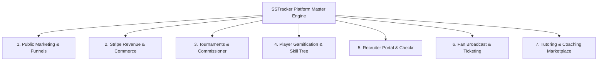

# 🚀 SSTRACKER (PROJECT PHOENIX) — 360-DEGREE PLATFORM AUDIT & MONETIZATION
**Role:** Chief Release Officer & Autonomous Cloud Swarm Commander
**Execution Target:** Google Jules on Sandboxed Cloud VMs (GitHub Actions)

---

## 🧭 THE 7 OPERATIONAL DOMAINS COVERED BY THIS WORKFLOW



### 1. 📢 Public Marketing & Acquisition Funnel
- **Routes**: `/`, `/pricing`, `/calculator`, `/tryouts`, `/features`, `/coach`, `/director`, `/player`, `/parent`
- **Verifications**:
  - Hero CTA buttons (Single Action Gold `#fbbf24` primary directive per viewport).
  - Pricing plan cards (Grassroots, Premier, Academy, Enterprise) and checkout triggers.
  - Interactive ROI revenue calculator sliders and dynamic savings output.

### 2. 💳 Stripe Revenue, Subscriptions & Commerce Gateways
- **Routes & Handlers**: `functions-commerce/`, `/upgrade`, `/director/dashboard?tab=licenses`
- **Verifications**:
  - Stripe Connect Express onboarding flow for Directors and Club Admins.
  - Tiered club seat billing, automated recurring invoices, and seat upgrades.
  - Team fee installments, player dues collections, and Stripe Split payouts.
  - Recruiter subscription purchases and talent pass revenue.
  - Tournament digital ticketing, gate check-in, and stay-and-play hotel rebates.

### 3. 🏆 Tournaments & Federation Governance (Commissioner OS)
- **Routes & Engines**: `/commissioner/dashboard`, `/commissioner/matrix`, `TournamentEngine.svelte.ts`, `FederationEngine.svelte.ts`
- **Verifications**:
  - Live tournament brackets, flight seeding, and pitch slot scheduling.
  - Federation state sanctioning, rule waivers, and compliance matrix.
  - Zero chamfers / strict 90-degree tactical governance aesthetics.

### 4. 🎮 Player Gamification, Skill Trees & Habit Streaks
- **Routes**: `/player/dashboard`, `/player/skill-tree`, `/player/workout`, `/player/armory`, `/player/proving-grounds`, `/player/tracker`
- **Verifications**:
  - Scout's Six Vanguard Prism (6-axis radar charts with clean canvas cleanup on unmount).
  - Visual Skill Mastery Tree with unlocked/locked node states.
  - Habit streak counters, XP increments, and 2% daily loss avoidance skill decay.
  - Visual celebration confetti strictly bound to verified database commits.

### 5. 🔍 Recruiter OS & Checkr Clearance
- **Routes**: `/recruiter`, `/recruit`
- **Verifications**:
  - NCAA/Pro scout talent directory, video showcase feeds, and NIL compliance.
  - Checkr background check verification gating (unverified scouts blocked).

### 6. 📺 Fan OS & Match Streaming
- **Routes**: `/fan`
- **Verifications**:
  - Sideline live video feeds, real-time match scoreboard, and Superdraw fundraisers.

### 7. ⚽ Private Tutoring & Marketplace
- **Routes**: `/directory`, `/tutor`
- **Verifications**:
  - Private 1-on-1 coach booking, calendar availability slots, and 5% platform split charges.

---

## 🧪 JULES CLOUD EXECUTION COMMANDS

### Step 1: Run the Exhaustive Platform Suite
```bash
pnpm playwright test tests/platform-exhaustive-master.spec.ts tests/persona-interactive-e2e.spec.ts tests/platform-cohesion-master.spec.ts --project=chromium
```

### Step 2: Run Targeted Commerce & Stripe Unit Tests
```bash
pnpm test -- src/lib/director/__tests__/directorBillingAuditPanel.guard.test.ts tests/stripe-onboarding.spec.ts
```

### Step 3: Run Static Validation & Type Check
```bash
npm run check
```
*Requirement: Exactly 0 errors.*

---

## 📦 SELF-HEAL & PR SUBMISSION PROTOCOL
If any assertion fails during cloud execution:
1. Identify failing component and determine if it violates Vanguard Trinity, B815 Hydration, or the 80-line limit.
2. Apply surgical patch to the component Brain or Glass layer.
3. Re-run Playwright suite to verify 100% green tests.
4. Capture screenshots to `/audit-artifacts/platform-exhaustive/`.
5. Open a Pull Request into `dev`.
