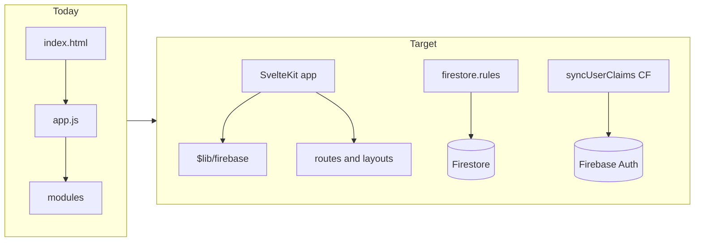

# SvelteKit migration and Foundation (RBAC) roadmap

## Current reality check

- **Stack today:** Single-page app served from Firebase Hosting ([`firebase.json`](firebase.json) rewrites everything to [`index.html`](index.html)), vanilla ES modules in [`app.js`](app.js) and [`modules/*.js`](modules/), global CSS in [`style.css`](style.css). **No root `package.json`**; only [`functions/package.json`](functions/package.json).
- **UI baseline:** [`style.css`](style.css) already defines fluid spacing (`--spacing-fluid: clamp(...)`), premium radius (`--radius-premium`), and glass-style cards—Epic 1 visual work is partly present; a migration can **preserve tokens** and evolve layout toward true bento grids inside Svelte layouts.
- **Auth / security gap:** [`modules/auth.js`](modules/auth.js) currently exports only `completeUserSetup` but [`app.js`](app.js) imports `checkMobileRedirect`, `handleGoogleLogin`, `handleEmailLogin`, `handleEmailSignup`, `handleLogout`, and `initSetupDropdowns`—this is a **hard runtime break** until restored or reimplemented during the SvelteKit port.
- **Server-side identity:** [`functions/index.js`](functions/index.js) stamps **custom claims** (`role`, `teamId`) from `users/{email}` via `onDocumentWritten`—good anchor for RBAC, but **Firestore rules are not in this repo** (no `firestore.rules`; [`firebase.json`](firebase.json) has no `firestore` block). Client-only checks in `navigateTo` ([`app.js`](app.js) ~107–121) are **not** sufficient for “absolute database separation.”
- **PWA:** [`sw.js`](sw.js) uses a fixed asset list (`index.html`, `style.css`, `app.js`) and compat Firebase for messaging—any SvelteKit build will require a **new caching strategy** (e.g. Vite PWA plugin or a generated precache manifest) so hashed assets stay correct.

---

## Phase A — SvelteKit scaffold (project shape)

1. **Initialize SvelteKit** at the repo root (or a deliberate subfolder if you must keep the legacy tree for a while—root is simpler for Hosting). Use **`@sveltejs/adapter-static`** with a fallback `200.html` / SPA mode compatible with your existing Hosting rewrite pattern, or migrate rewrites to SvelteKit’s output (`build` → Hosting `public`).
2. **Environment and Firebase client:** Move [`firebase-config.js`](firebase-config.js) (and dev/prod variants) into `$lib` with `import.meta.env` for non-secret config; keep secrets out of the client bundle.
3. **Styling:** Import existing [`style.css`](style.css) as global styles initially, then **incrementally** move view-scoped styles into `<style>` in Svelte components (matches your long-term `.cursorrules` direction without a risky big-bang CSS rewrite).
4. **PWA / SW:** Replace hand-maintained [`sw.js`](sw.js) with a generated service worker (recommended: `vite-plugin-pwa`) so precache tracks **hashed** bundles; re-test FCM if you rely on [`sw.js`](sw.js) messaging initialization.

---

## Phase B — Incremental feature port (minimize regression)

Port in **thin vertical slices** so each slice is shippable:

| Slice | Rationale |
|--------|-----------|
| **Auth shell** (login, setup, logout) | Unblocks everything; fixes missing exports; establishes `+layout.svelte` session pattern. |
| **App chrome** (header, nav, role visibility) | Central place for navigation guards. |
| **Player flows** (home, tracker, stats, challenges, passport) | Largest user surface; can mirror existing module logic moved into `$lib/stores` or small composables. |
| **Coach / director / admin** | Keep behind the same route/layout guards; defer SortableJS / RAG until Epic 3. |

**Practical approach:** For each old [`modules/*.js`](modules/) file, either (a) import and wrap minimally inside `onMount` during transition, or (b) port logic into `.svelte` + TS/JS modules—prefer (b) for auth and routing, (a) only as a temporary bridge for complex canvases ([`modules/coach.js`](modules/coach.js) spatial/strategy) to control scope.

---

## Phase C — Foundation A: Auth + claims + rules (your “option A”)

1. **Restore parity auth API** in Svelte land: Google `signInWithPopup`, email/password, `signOut`, setup dropdown population, and `getRedirectResult` only if you still need mobile redirect recovery (your `.cursorrules` bias is popup-first—keep it).
2. **Align UI gates with claims:** After `onAuthStateChanged`, call `getIdTokenResult()` and use `token.claims.role` / `teamId` for **route and component** visibility; keep Firestore profile reads for display fields but **do not trust client-only profile.role** for security-sensitive decisions.
3. **Author and commit [`firestore.rules`](firestore.rules):** Default deny, validator-style functions, no self-escalation of `role`, and collection-specific rules keyed off `request.auth.token.role`, `request.auth.token.teamId`, and `request.auth.uid` / email mapping as appropriate. Document assumed collections at the top of the rules file (per Firebase skills in [`.agents/skills/firebase-firestore-standard/references/security_rules.md`](.agents/skills/firebase-firestore-standard/references/security_rules.md)).
4. **Wire `firebase.json`:** Add a `firestore` section pointing at `firestore.rules` (and indexes file when you add composite queries).
5. **Extend [`functions/index.js`](functions/index.js) carefully:** When introducing `parent` and household linkage, add fields to claims only after rules can consume them safely (avoid leaking unrelated PII into claims—keep claims minimal: `role`, `teamId`, `clubId`, `linkedPlayerIds` or similar).

---

## Phase D — Household schema (starter for Epic 1.2 / parents)

- **Data model (suggested direction):** `households/{householdId}` with parent UIDs/emails and `playerUserIds` or stable `playerDocKeys`; or `users/{email}` with `role: 'parent'` and `children: [...]` **plus** rules that only allow parents to read child **aggregates** / non-coach collections. Split sensitive vs display data if minors’ PII is involved (Firestore cannot field-level restrict within one document).
- **App behavior:** Parent UI is read-heavy (stats, trials, attendance); **no** coach tooling unless `role === 'coach'` and rules allow writes.

Defer full **VPC / biometric consent** flows (Epic 2.1) until RBAC and schema are stable; they will hang off explicit consent documents and flags on those collections.

---

## What this plan intentionally defers

- **Epic 3–6** (SortableJS curriculum, vector RAG, Affinity OAuth, recruiter B2B, gamification push) — sequence **after** Phase C+D so AI and integrations are not built on an open data plane.
- **Full UI bento pass** — can run in parallel with port once layouts live in Svelte; not a blocker for Foundation A.

---

## Alignment note (`.cursorrules` vs repo)

Your [`.cursorrules`](.cursorrules) already mandates Svelte 5 + SvelteKit; the **codebase was vanilla**. This migration makes the repo match the rule set; update `.cursorrules` only if you drop constraints (e.g. inline-style ban) that no longer fit.
