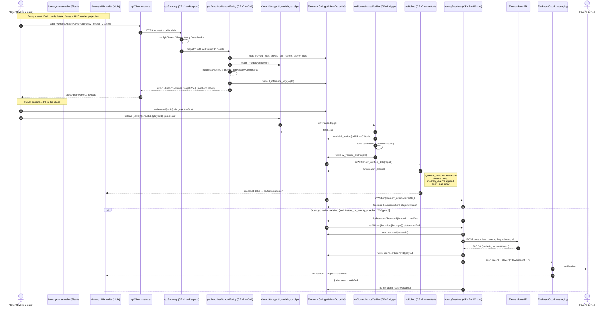

# Nexus Command — Core Data Flow & Asynchronous Lifecycle Reference

**Status:** Canonical / Source of Truth
**Companion documents:** [`ARCHITECTURE.md`](./ARCHITECTURE.md), [`CELL_ROUTING.md`](./CELL_ROUTING.md), [`RL_ADAPTIVE_WORKOUTS.md`](./RL_ADAPTIVE_WORKOUTS.md), [`CLEARANCE.md`](./CLEARANCE.md), [`MAGIC_UPLINKS.md`](./MAGIC_UPLINKS.md), [`COPPA_ATTESTATION.md`](./COPPA_ATTESTATION.md), [`PHONE_VERIFICATION.md`](./PHONE_VERIFICATION.md), [`TEEN_AD_BLOCK.md`](./TEEN_AD_BLOCK.md)

**Acquisition demo gold paths:** For diligence-ready sequence diagrams (GP-ACQ, GP-PARENT, GP-COACH, tryouts, SafeSport) with honest **Shipped · Partial · Planned** labels, see [`docs/acquisition/ARCHITECTURE_DATA_FLOWS.md`](./acquisition/ARCHITECTURE_DATA_FLOWS.md). This document retains the full liability-heavy async loops below (CV, Tremendous escrow, staff onboarding, COPPA) — cross-link rather than duplicate.

> This document maps the asynchronous data loops that power the three highest-liability surfaces of the platform: the Adaptive Workouts → Octalysis Bounty loop, the Zero-Liability Staff Onboarding loop, and the Household Ingestion + COPPA 2.0 compliance loop. Each section below pairs a written walkthrough with a fully self-contained Mermaid sequence diagram. Every actor, function, and collection named here resolves to a sanctioned path defined in `ARCHITECTURE.md` (`getActiveDb()` on the client, `getAdminDb(cellId)` / `getRegistryDb()` on the server, the `apiGateway` ingress, and Firestore triggers under `functions/src/**`).
>
> **Compliance invariants enforced by every flow below:**
>
> - **Zero-Liability PII** — privileged identifiers never traverse a cell boundary; outbound third-party calls only carry minted, scoped tokens.
> - **Strict Tenant Isolation** — every Firestore read/write is keyed by `tenantId` inside a `cellId`-scoped database resolved from the caller's JWT custom claim.
> - **Lazy Read-Repair Migration** — destructive backfills are forbidden; missing keys are patched in memory and merged with `{ merge: true }`.
> - **Atomic Mutation Discipline** — XP grants, payouts, role elevations, and consent flips run inside Firestore transactions or `WriteBatch` commits with `FieldValue.increment` / `FieldValue.serverTimestamp`.
> - **Backend-Issued Cell Claim** — the client never selects a cell. The `cellId` is minted by `apiGateway` and embedded in the Firebase ID token.

---

## Table of Contents

1. [Adaptive Workouts & Octalysis Loop](#1-adaptive-workouts--octalysis-loop)
2. [Zero-Liability Staff Onboarding](#2-zero-liability-staff-onboarding)
3. [Household Ingestion & COPPA 2.0 Compliance](#3-household-ingestion--coppa-20-compliance)
4. [Cross-Cutting Guarantees](#4-cross-cutting-guarantees)

---

## 1. Adaptive Workouts & Octalysis Loop

**Surface:** Player Armory → Daily Training prescription → Video proof upload → Computer-Vision biomechanical verification → Atomic XP / streak / mastery rollup → Parent-funded escrow bounty payout via Tremendous.

**Trinity ownership (client side):**

- **Shell** — `routes/(app)/player/armory/+page.svelte`
- **Brain** — `lib/states/ArmoryEngine.svelte.ts` (Svelte 5 runes, `$state` / `$derived` / `$effect`)
- **Glass** — `ArmoryArena.svelte` (Composite Snowflake hex graph, video drop target)
- **HUD** — `ArmoryHUD.svelte` (root `tw-pointer-events-none`; bounty cards, XP ticker, particle confetti)

**Synthetic vs. Drill-as-Node:** the Brain holds Synthetic Authored Nodes only ("Pace", "Vision", "First Touch"). The RL planner returns a `prescribedWorkout` payload whose drill IDs are resolved against the projection cache `synthetic_axes/{playerId}/{axisId}` so the UI never sees raw `drill_nodes/*` rows.

### 1.1 Written Walkthrough

1. **Daily training request.** When the Armory mounts, the Brain's `$effect` calls `apiClient.post('/v1/rl/getAdaptiveWorkoutPolicy')`. The bearer token carries the player's `cellId` and `tenantId` claims.
2. **Gateway dispatch.** `apiGateway` (Cloud Functions v2 `onRequest`) verifies the ID token, checks the registry idempotency cache (`registry/gateway_idempotency`), applies the rate bucket, and routes to the registered `getAdaptiveWorkoutPolicy` callable.
3. **State vector + RL inference.** The handler builds the 50-element Float32 state vector (RPE, soreness, sleep, mood, streak, adherence; see `RL_ADAPTIVE_WORKOUTS.md`), loads the active policy from `gs://…/rl_models/policy/v{n}/`, runs ε-greedy action selection, and applies the safety constraint layer (age-band caps, overtraining override).
4. **Inference logged.** A row is written to `cells/{cellId}/rl_inference_log/{logId}` with the chosen `(drillId, durationMinutes, targetRpe)` and policy version. The response, with synthetic labels resolved, is returned to the Brain.
5. **Player executes the drill.** The Brain renders the prescribed reps in the Glass. On completion the Brain writes a raw telemetry doc `cells/{cellId}/reps/{repId}` via `getActiveDb()` and uploads the video proof to Cloud Storage at `gs://nexus-cv/{cellId}/{tenantId}/{playerId}/{repId}.mp4`.
6. **CV biomechanical verification.** The Storage finalize event triggers `cvBiomechanicsVerifier` (CF v2). The function pulls the clip, runs the pose-estimation model, scores each criterion against `drill_nodes/{drillId}.cvCriteria`, and writes the result to `cv_verified_drill/{repId}` with `{ verified, confidence, criteriaPassed[], criteriaFailed[] }`.
7. **Atomic XP & streak rollup.** A Firestore trigger `onWritten('cv_verified_drill/{repId}')` opens a `WriteBatch` against `getAdminDb(cellId)` and atomically:
   - increments `synthetic_axes/{playerId}/{axisId}.xp` via `FieldValue.increment(delta)` for every axis the drill rolls up to;
   - bumps `streaks/{playerId}.currentDays` and refreshes `lastActiveAt`;
   - appends a `mastery_events/{eventId}` row;
   - records an `audit_logs` entry stamped with `serverTimestamp()` and `policyVersion`.
   The whole batch commits atomically — partial XP grants are mathematically impossible.
8. **Bounty evaluation.** A second trigger `onWritten('mastery_events/{eventId}')` walks all open `bounties/{bountyId}` rows where `playerId == event.playerId` and `criterion ∈ {reps, workouts, streak, mastery, gpa, cv_verified_drill}`. When a bounty is satisfied (and `feature_cv_bounty_enabled` is true for CV-gated bounties), the bounty row is transactionally flipped from `funded` → `verified`.
9. **Tremendous escrow payout.** A third trigger fires on the bounty status flip and calls `tremendousPayoutDispatcher` (CF v2). It reads the parent-funded escrow row from `escrow/{escrowId}`, posts to the Tremendous API with an idempotency key derived from `bountyId`, and on a `200 OK` writes the payout receipt back into `bounties/{bountyId}.payout = { provider: 'tremendous', orderId, amountCents, currency, sentAt }`. A failure rolls the bounty back to `funded` and writes an `audit_logs` retry row — funds never leave escrow without the verified write.
10. **Closing the loop.** `onWritten('bounties/{bountyId}')` with `payout != null` fans an FCM push back to the parent ("Reward sent ✓") and to the player's Brain, which trips a HUD particle explosion through the dopamine engine.

### 1.2 Sequence Diagram



---

## 2. Zero-Liability Staff Onboarding

**Surface:** Director invites a Coach (or Recruiter / Tutor) → recipient redeems an Email Magic Uplink (passwordless) → embedded Checkr SDK runs the background clearing → Firestore RBAC role is elevated only after the JWT `isCleared` claim flips to `true`.

**Why this matters:** Coaches, recruiters, directors, and tutors all have potential contact-level exposure to minor PII. The U.S. Center for SafeSport bar applies. No role elevation is permitted before `users/{email}.clearance.status === 'cleared'` and the `isCleared` custom claim is stamped on the user's token. There is no SMS in this flow — Magic Uplinks are email-only, single-use, and time-locked.

### 2.1 Written Walkthrough

1. **Director generates the invite.** From `routes/(app)/admin/organizations/[clubId]/teams/+page.svelte` the director calls `OrgManager.generateInvite({ targetRole: 'coach', teamId, usageLimit: 1 })`. This routes through `inviteService.generateInviteCode`, which mints a `<tokenId>.<secret>` pair, stores `hex(scrypt(secret, salt))` in `cells/{cellId}/invites/{tokenId}` with TTL = 14 days, and returns the plain token only to the calling director.
2. **Email dispatch.** A CF v2 trigger on `invites/{tokenId}` (status `pending`) fans the message through the comms pipeline. The link `https://vanguard.app/uplink/<tokenId>.<secret>` is the only carrier of the secret — it is never logged, persisted in plaintext, or returned by any callable.
3. **Coach clicks the link.** The browser hits the SvelteKit route `/uplink/[token]/+page.svelte`. The Brain calls `consumeInviteCode(token)` (CF v2 `onCall`).
4. **Atomic redemption.** The redeemer transactionally:
   - splits `<tokenId>.<secret>`,
   - reads `invites/{tokenId}`,
   - rejects if `consumed`, `expired`, or `usageLimit <= 0`,
   - timing-safe-compares `hex(scrypt(secret, storedSalt))` against the stored hash,
   - decrements `usageLimit`, stamps `consumedAt`,
   - mints a Firebase custom token with `tenantId`, `clubId`, `cellId`, and `pendingRole: 'coach'` claims (note: not yet `role: 'coach'`).
5. **Pending-role gate.** The client signs in with `signInWithCustomToken`. The `(app)/+layout.svelte` clearance gate sees `pendingRole != null && isCleared !== true` and redirects the coach to `/compliance`.
6. **Embedded Checkr SDK.** `/compliance/+page.svelte` mounts the `CheckrEmbed` component (iframe). The client opens a Checkr candidate session via `createCheckrCandidateSession` (CF v2 `onCall`) which issues a short-lived candidate-scoped session token. The candidate completes the SSN / DOB / address capture inside the Checkr-hosted iframe — **no PII ever crosses our backend**. Checkr begins the background clearing.
7. **Webhook callback.** Checkr POSTs the report-status update to `https://us-central1-nexus-command.cloudfunctions.net/checkrWebhook`. The handler validates the HMAC signature against the shared secret, dedupes on `report.id`, maps `report.status` → Vanguard status (`clear → cleared`, `consider|suspended → flagged`, else `pending`), and writes `users/{email}.clearance = { status, checkrCandidateId, lastVerified, clearedAt, expiresAt }` with `{ merge: true }`.
8. **Stamp the JWT claim.** The same handler invokes `stampClearanceClaim(uid, email)` which calls `admin.auth().setCustomUserClaims` with `isCleared = true` (only on `cleared`). It also revokes the user's existing refresh tokens so the next request must mint a fresh ID token carrying the new claim.
9. **Role elevation.** A Firestore trigger `onWritten('users/{email}/clearance')` with `status === 'cleared'` reads the parked `pendingRole` from `users/{email}.pendingRole` and calls the role elevator. It writes `tenants/{tenantId}/members/{email}.role = 'coach'`, swaps `pendingRole` → `null`, and sets the `role: 'coach'` custom claim. `firestore.rules#isCleared()` and `#isCoach()` both now evaluate `true`.
10. **Coach next launch.** On next page load the client calls `getIdToken(true)` to force-refresh, lands in the Coach surface, and the audit log records `clearance_passed` + `role_elevated` events keyed by `tenantId` and `cellId`.

### 2.2 Sequence Diagram

```mermaid
sequenceDiagram
    autonumber
    actor Dir as Director (Trinity Brain)
    participant OrgUI as Organizations Shell (+page.svelte)
    participant OrgMgr as OrgManager (svelte.ts Brain)
    participant InvSvc as inviteService.generateInviteCode (CF v2 onCall)
    participant DB as Firestore Cell (getAdminDb cellId)
    participant Mail as Email Provider
    actor Coach as Coach (Recipient Browser)
    participant Uplink as /uplink/[token]/+page.svelte
    participant Redeem as consumeInviteCode (CF v2 onCall)
    participant Auth as Firebase Auth (custom claims)
    participant Comp as /compliance/+page.svelte
    participant Checkr as Checkr Embedded SDK (iframe)
    participant CkSess as createCheckrCandidateSession (CF v2 onCall)
    participant Hook as checkrWebhook (CF v2 onRequest)
    participant Stamp as stampClearanceClaim
    participant Role as roleElevator (CF v2 onWritten)

    Dir->>OrgUI: click "Invite Coach"
    OrgUI->>OrgMgr: generateInvite('coach', teamId, 1)
    OrgMgr->>InvSvc: callable
    InvSvc->>InvSvc: mint tokenId.secret + scrypt hash
    InvSvc->>DB: write invites/{tokenId} (hash, ttl=14d)
    InvSvc-->>OrgMgr: { token, expiresAt } (plain token only here)
    DB->>Mail: onCreate trigger → comms pipeline
    Mail-->>Coach: email with /uplink/<tokenId>.<secret>

    Coach->>Uplink: open link
    Uplink->>Redeem: consumeInviteCode(token)
    Redeem->>DB: txn read invites/{tokenId}
    Redeem->>Redeem: scrypt + timingSafeEqual
    Redeem->>DB: txn decrement usageLimit, set consumedAt
    Redeem->>Auth: createCustomToken(uid, {tenantId, clubId, cellId, pendingRole:'coach'})
    Redeem-->>Coach: customToken
    Coach->>Auth: signInWithCustomToken
    Auth-->>Coach: ID token (pendingRole='coach', isCleared=false)
    Coach->>Comp: layout gate redirect (/compliance)

    Comp->>CkSess: createCheckrCandidateSession()
    CkSess->>Checkr: POST /v1/candidates (server-to-server)
    Checkr-->>CkSess: { candidateId, sessionToken (short-lived) }
    CkSess->>DB: write users/{email}.clearance = {status:'pending', checkrCandidateId}
    CkSess-->>Comp: sessionToken
    Comp->>Checkr: mount embedded iframe with sessionToken
    Coach->>Checkr: enter SSN/DOB/address (Checkr-hosted; never reaches our backend)
    Checkr->>Checkr: run background clearing
    Checkr->>Hook: POST report.completed (HMAC signed)
    Hook->>Hook: verify HMAC + dedupe on report.id
    Hook->>DB: merge users/{email}.clearance = {status:'cleared', clearedAt, expiresAt}
    Hook->>Stamp: stampClearanceClaim(uid, email)
    Stamp->>Auth: setCustomUserClaims({isCleared:true})
    Stamp->>Auth: revokeRefreshTokens(uid)

    DB->>Role: onWritten(users/{email}/clearance) status=cleared
    Role->>DB: read users/{email}.pendingRole
    Role->>DB: write tenants/{tenantId}/members/{email}.role='coach'
    Role->>DB: clear users/{email}.pendingRole
    Role->>Auth: setCustomUserClaims({role:'coach', isCleared:true})
    Role->>DB: append audit_logs (clearance_passed, role_elevated)

    Coach->>Auth: getIdToken(true) on next page load
    Auth-->>Coach: ID token (role='coach', isCleared=true)
    Note over Coach: firestore.rules isCleared() && isCoach() now true ✓
```

---

## 3. Household Ingestion & COPPA 2.0 Compliance

**Surface:** Director uploads a roster CSV with placeholder rows (no minor PII) → each placeholder is converted into a real account through Native Firebase Phone Number Verification (carrier-direct, no SMS billing) → the responsible parent's consent decision is bound to a **WebAuthn Biometric Enclave** credential (TouchID / FaceID / Windows Hello) → on consent, database interceptors hard-lock the teen profile against ad-targeting data sharing.

**Roles produced:** `parent` (adult, no clearance required), `player` ages split into `under13`, `teen13to16`, `adult` per `computeAgeBand(dob)`. The `ageBand` claim is what drives the four-layer ad-block stack defined in `TEEN_AD_BLOCK.md`.

### 3.1 Written Walkthrough

1. **CSV placeholder ingestion.** The Director opens `routes/(app)/admin/organizations/[clubId]/teams/[teamId]/roster/+page.svelte` and uploads a CSV containing only non-PII placeholders: jersey number, position, age band hint, and a parent contact handle (email *or* unverified phone). The Brain calls `ingestRosterPlaceholders` (CF v2 `onCall`), which writes one `placeholders/{placeholderId}` row per line into the cell's database. **No DOB, no SSN, no full name, no address** are accepted at this stage; the schema validator rejects the row if any of those fields are present.
2. **Magic Uplink dispatched to the parent.** For each placeholder the trigger creates a `parent` Magic Uplink (TTL = 7 days) and emails the link. The link lands at `/uplink/[token]/+page.svelte`.
3. **Parent redeems and lands at `/onboarding/phone`.** After `consumeInviteCode` the parent is signed in with a `pendingRole: 'parent'` custom token and routed to the phone-verification step.
4. **Native Firebase Phone Number Verification.** The Brain initializes `signInWithPhoneNumber` using the carrier-direct verifier (where supported, Android Play Integrity / iOS APNs silent verification is preferred so no SMS code is ever sent — the carrier confirms the number directly). The fallback is a Firebase reCAPTCHA-gated SMS code. On successful verification the parent's `phoneNumber` and `phoneVerifiedAt` are stamped into `users/{email}` and into the JWT.
5. **Child profile bootstrap.** The parent is asked to confirm the child's date of birth (the only PII transfer event for the minor). `setPlayerDateOfBirth` (CF v2 `onCall`) writes `users/{childEmail}.dob` and computes `ageBand = computeAgeBand(dob)` per `TEEN_AD_BLOCK.md`. The placeholder row is upgraded to a real `player` member of `tenants/{tenantId}/members/{childEmail}`.
6. **WebAuthn challenge for COPPA consent.** If `ageBand !== 'adult'`, the client routes to `/consent/[token]/+page.svelte`. The Brain calls `generateConsentAttestationChallenge({token})`, which writes a 32-byte random challenge into `consent_tokens/{token}.webauthnChallenge` and returns `{ challenge, rpId, userIdHandle, userName }`.
7. **Biometric enclave attestation.** The browser invokes `navigator.credentials.create({ publicKey: { challenge, rp:{id:rpId,name:'VANGUARD COPPA Consent'}, user:{ id:userIdHandle, name:parentEmail }, pubKeyCredParams:[ES256, RS256], authenticatorSelection:{ userVerification:'required' }, attestation:'direct' } })`. The OS pops the platform biometric prompt — **TouchID, FaceID, or Windows Hello**. The signing key never leaves the secure enclave; only the public key + attestation object reaches the browser.
8. **Server verification.** The client sends `attestParentalConsent({ token, action:'granted'|'denied', attestationObjectB64, clientDataJSONB64, credentialIdB64 })`. The handler:
   - validates that the token is not consumed and not expired,
   - parses `clientDataJSON` (`type === 'webauthn.create'`, `challenge` matches stored value, `origin` matches `WEBAUTHN_RP_ORIGIN`),
   - decodes the CBOR `attestationObject`, verifies the SHA-256 RP ID hash, asserts the User-Verification flag (bit 2 of `authData[32]`), and extracts the COSE public key.
9. **Atomic consent flip.** Inside one Firestore transaction the handler:
   - consumes `consent_tokens/{token}`,
   - flips `users/{childEmail}.coppaStatus = 'granted'|'denied'`,
   - writes the immutable record `coppa_attestations/{tokenId}` (public key, credential id, attestation object, granted-by `parentEmail`, server timestamp),
   - on `granted`, sets `setCustomUserClaims({ vpcVerified: true, ageBand })` on the parent's account,
   - appends a `consent_logs` audit entry.
10. **Database interceptor hard-lock.** A Firestore trigger `onWritten('users/{email}.ageBand')` evaluates `ageBand`. If `ageBand ∈ {'under13','teen13to16'}` the trigger writes `users/{email}.adShareLocked = true` and stamps the `ageBand` JWT claim. From this point on:
    - **Layer 1 — Firestore Rules:** `isTeen13to16()` / `ageBandBlocksAdShare()` reject any write to `public_player_profiles` or `recruiter_export_log` for that subject.
    - **Layer 2 — CF Write Validators:** `teenAdInterceptor.assertNoTeenForAdContext()` throws inside `recruiterBilling`, `profileSyncer`, `partnerHandlers`, and any mail dispatch carrying ad-context.
    - **Layer 3 — Client Pixel Suppression:** `teenAdGuard.svelte.js` short-circuits `loadThirdPartyScript()` for FB Pixel / `gtag`.
    - **Layer 4 — Cell-Level Egress Whitelist:** `egressGuard.js` wraps `globalThis.fetch` and refuses any non-whitelisted outbound URL when the request's `AsyncLocalStorage` taint marks it as carrying teen subject data.
11. **Failure modes.**
    - **WebAuthn unsupported browser** — the Brain falls back to the classical `verifyParentalConsent` callable; a banner is shown, and **no `coppa_attestations` row is created**, but the legal consent is still recorded with the same `coppaStatus` flip.
    - **Phone verification fallback** — if Play Integrity / APNs silent verification fails, a reCAPTCHA-gated SMS is sent as the last resort; rate-limited per `MAGIC_UPLINKS.md`.
    - **`coppaStatus !== 'granted'`** — the Firestore rules block all child reads / writes; no telemetry can be ingested for that subject until consent is obtained.

### 3.2 Sequence Diagram

```mermaid
sequenceDiagram
    autonumber
    actor Dir as Director
    participant Roster as Roster Shell (+page.svelte)
    participant Ingest as ingestRosterPlaceholders (CF v2 onCall)
    participant DB as Firestore Cell (getAdminDb cellId)
    participant Mail as Email Provider
    actor Parent as Parent (Browser + Device Enclave)
    participant Uplink as /uplink/[token]
    participant Redeem as consumeInviteCode (CF v2 onCall)
    participant Auth as Firebase Auth (custom claims)
    participant Phone as Native Firebase Phone Verifier (carrier-direct)
    participant Onboard as /onboarding/phone (Brain)
    participant Dob as setPlayerDateOfBirth (CF v2 onCall)
    participant Consent as /consent/[token] (Brain)
    participant Chal as generateConsentAttestationChallenge (CF v2 onCall)
    participant Enclave as Platform Biometric (TouchID / FaceID / Hello)
    participant Attest as attestParentalConsent (CF v2 onCall)
    participant Lock as adShareInterceptor (CF v2 onWritten)
    participant Rules as Firestore Rules + Egress Guard

    Dir->>Roster: upload placeholders.csv (no PII)
    Roster->>Ingest: callable
    Ingest->>Ingest: schema validate (reject DOB/SSN/name/address)
    Ingest->>DB: write placeholders/{placeholderId}[]
    DB->>Mail: onCreate trigger → parent Magic Uplink (TTL 7d)
    Mail-->>Parent: email with /uplink/<tokenId>.<secret>

    Parent->>Uplink: open link
    Uplink->>Redeem: consumeInviteCode(token)
    Redeem->>DB: txn redeem invite
    Redeem->>Auth: customToken (pendingRole='parent', cellId, tenantId)
    Redeem-->>Parent: signInWithCustomToken
    Parent->>Onboard: routed to /onboarding/phone

    Onboard->>Phone: signInWithPhoneNumber(parentMsisdn)
    alt Play Integrity / APNs silent verification supported
        Phone->>Phone: carrier-direct confirmation (no SMS sent)
    else Fallback
        Phone-->>Parent: reCAPTCHA + SMS code (rate-limited)
        Parent->>Phone: enter code
    end
    Phone-->>Auth: phoneVerified=true
    Auth->>DB: merge users/{email}.phoneNumber, phoneVerifiedAt

    Parent->>Dob: confirm child DOB
    Dob->>DB: write users/{childEmail}.dob
    Dob->>Dob: ageBand = computeAgeBand(dob)
    Dob->>DB: write users/{childEmail}.ageBand
    Dob->>DB: upgrade placeholder → tenants/{tenantId}/members/{childEmail}

    alt ageBand != 'adult'
        Onboard->>Consent: redirect /consent/[token]
        Consent->>Chal: generateConsentAttestationChallenge({token})
        Chal->>DB: write consent_tokens/{token}.webauthnChallenge
        Chal-->>Consent: { challenge, rpId, userIdHandle, userName }
        Consent->>Enclave: navigator.credentials.create({publicKey:{...UV required, attestation:'direct'}})
        Enclave-->>Parent: biometric prompt
        Parent->>Enclave: scan finger / face
        Enclave-->>Consent: PublicKeyCredential (attestationObject, clientDataJSON, credentialId)
        Consent->>Attest: attestParentalConsent({token, action, ...B64})
        Attest->>DB: txn read consent_tokens/{token}
        Attest->>Attest: verify clientDataJSON (type, challenge, origin)
        Attest->>Attest: CBOR decode + RP ID hash + UV flag + COSE pubkey
        Attest->>DB: txn (consume token, flip users/{childEmail}.coppaStatus, write coppa_attestations/{tokenId})
        Attest->>Auth: setCustomUserClaims({vpcVerified:true, ageBand})
        Attest->>DB: append consent_logs
        Attest-->>Consent: { success:true, attestationStored:true }
    else WebAuthn unsupported
        Consent->>Attest: verifyParentalConsent (classical fallback)
        Note over Attest,DB: same coppaStatus flip; no coppa_attestations row
    end

    DB->>Lock: onWritten(users/{childEmail}.ageBand)
    alt ageBand ∈ {'under13','teen13to16'}
        Lock->>DB: write users/{childEmail}.adShareLocked = true
        Lock->>Auth: stamp ageBand custom claim
        Lock->>Rules: enforce 4-layer ad-block stack
        Note right of Rules: L1 firestore.rules ageBandBlocksAdShare()<br/>L2 teenAdInterceptor server validators<br/>L3 teenAdGuard pixel suppression<br/>L4 egressGuard fetch whitelist
    else ageBand == 'adult'
        Lock->>DB: no-op (audit)
    end
```

---

## 4. Cross-Cutting Guarantees

The three loops above share a common spine of zero-liability guarantees. Any future flow added to this document must satisfy all of them.

| Guarantee | Mechanism | Verified By |
| --------- | --------- | ----------- |
| **Single ingress** | All privileged writes traverse `apiGateway` (CF v2 `onRequest`) behind the `/v1/**` rewrite. | `firestore.rules` deny direct privileged writes; `cellRouter.register` is the only dispatcher. |
| **Backend-issued cell** | `cellId` is minted as a JWT custom claim by the gateway. Client never picks a cell. | `getActiveDb()` reads the claim; `getAdminDb(cellId)` is path-derived for triggers. |
| **Atomic mutation** | XP rollups, role elevations, payout writes, and consent flips run inside Firestore transactions or `WriteBatch` commits with `FieldValue.increment` / `serverTimestamp`. | Triggers use `runTransaction` (`xpRollup`, `bountyResolver`, `attestParentalConsent`). |
| **Idempotency** | `apiGateway` consults `registry/gateway_idempotency`; Tremendous calls use `bountyId` as the idempotency key; Checkr webhook dedupes on `report.id`. | Replay tests in `functions/test/**`. |
| **Lazy read-repair** | Missing `sportId` / `schemaVersion` / `tenantId` are patched in memory and merged async with `{ merge: true }`. Destructive backfills are forbidden. | `.cursorrules` §2; `ARCHITECTURE.md` §1 invariant. |
| **PII isolation** | Checkr SSN/DOB/address never leaves the Checkr-hosted iframe. WebAuthn private keys never leave the device enclave. RL state vectors are pure numerics. | `CLEARANCE.md`, `COPPA_ATTESTATION.md`, `RL_ADAPTIVE_WORKOUTS.md`. |
| **Teen ad hard-lock** | `ageBand ∈ {under13, teen13to16}` triggers a four-layer enforcement stack (Firestore rules, CF write validators, client pixel suppression, cell-level egress whitelist). | `TEEN_AD_BLOCK.md`. |
| **Audit trail** | Every flow appends to `audit_logs` (per cell) and, where applicable, `consent_logs`. Both are append-only. | `firestore.rules` deny update/delete on these collections. |

---

### Change Control

This document follows the same merge gate as `ARCHITECTURE.md`. Any pull request that:

- adds, removes, or reorders a step in any of the three flows above,
- introduces a new external integration in any flow,
- changes the cell-routing or claim-minting contract,
- alters the COPPA / teen ad-block enforcement surface,

**must** update the corresponding sequence diagram and walkthrough in the same commit. Drift between `DATA_FLOW.md` and the implementing code is treated as a regression and blocks merge.
