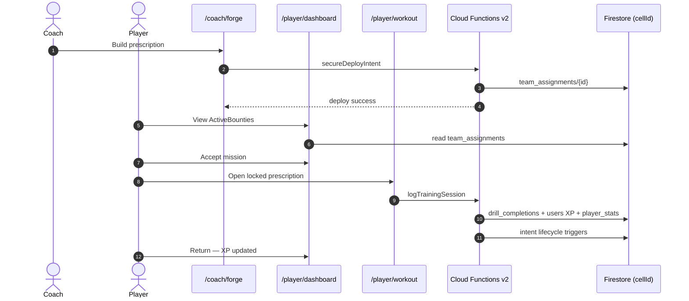
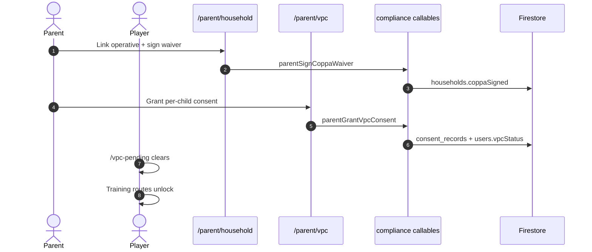
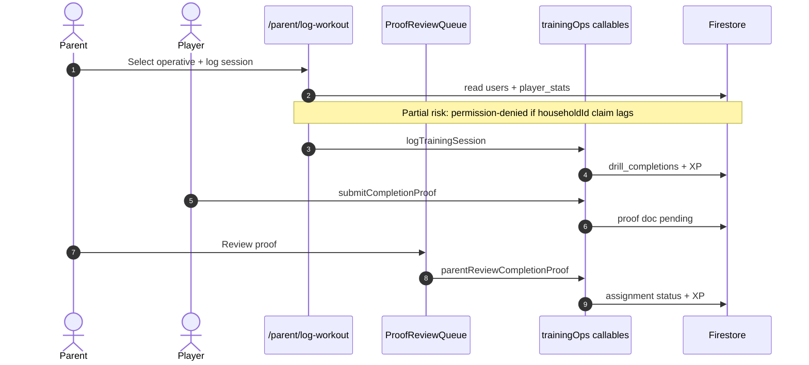
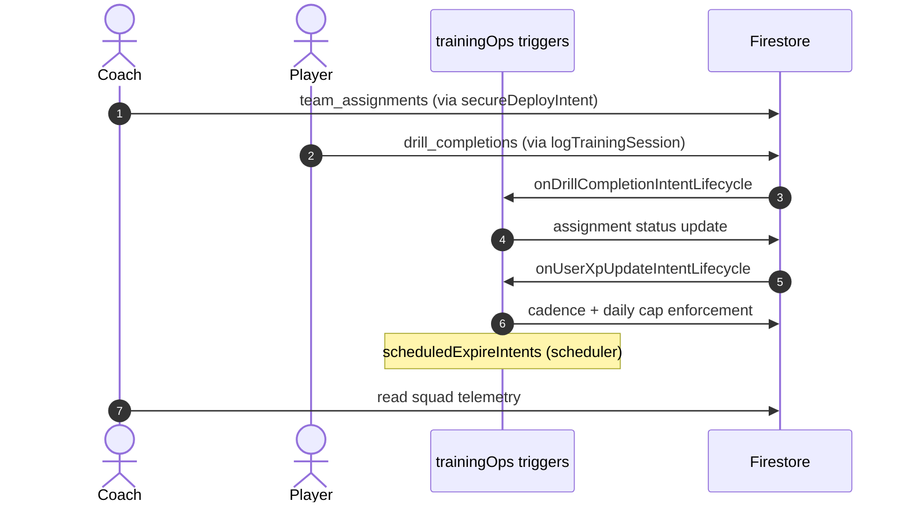
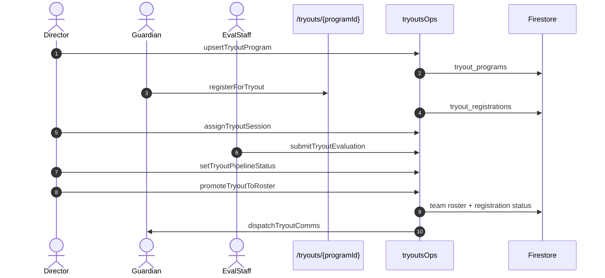
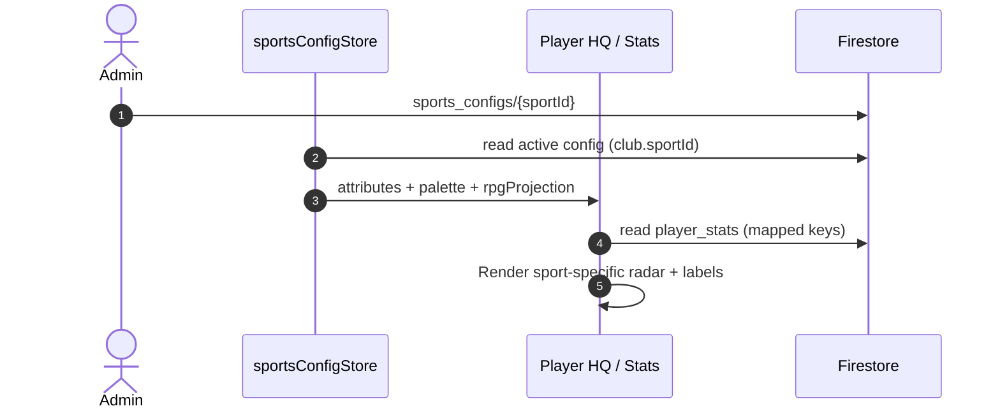
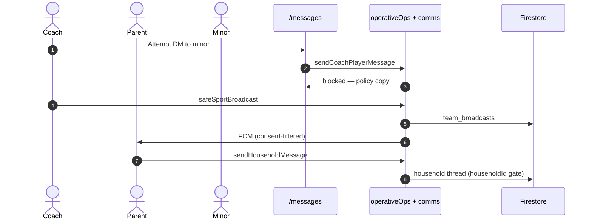
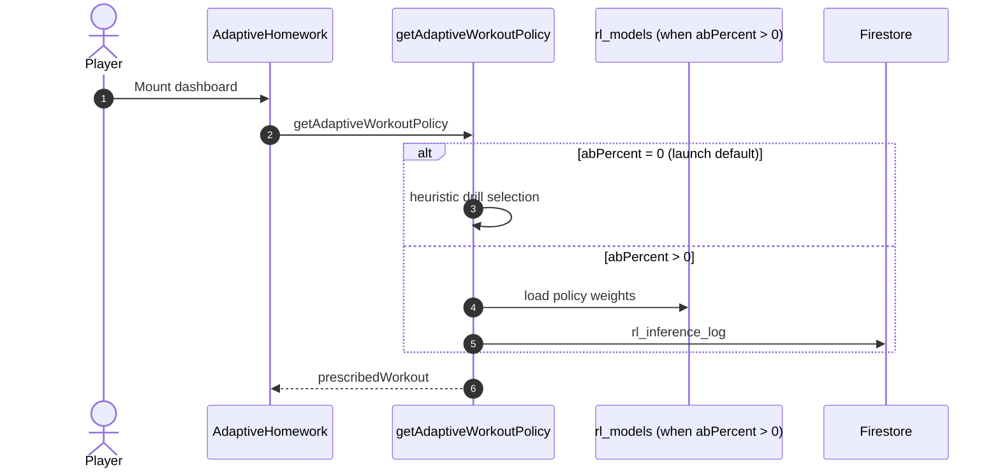

# SSTracker — Architecture & Gold-Path Data Flows

**Purpose:** Acquirer-readable sequence-level walkthroughs complementing [`ARCHITECTURE.md`](../ARCHITECTURE.md).  
**Status badges:** **Shipped** · **Partial** · **Planned**  
**Last updated:** 2026-06-25 · ACQ-DATAROOM-COMPLETE

> For liability-heavy async loops (CV verification, Tremendous escrow, staff onboarding), see also [`DATA_FLOW.md`](../DATA_FLOW.md). This document focuses on **acquisition demo gold paths** with honest status labels.

---

## Flow index

| # | Flow | Status |
|---|------|--------|
| 1 | [GP-ACQ — Coach Forge → Player HQ → Train → XP](#1-gp-acq--coach-forge--player-hq--train--xp) | **Shipped** (core) |
| 2 | [GP-PARENT — Household waiver + VPC → operative unlock](#2-gp-parent--household-waiver--vpc--operative-unlock) | **Shipped** |
| 3 | [GP-PARENT — Co-op log workout + proof review](#3-gp-parent--co-op-log-workout--proof-review) | **Partial** |
| 4 | [GP-COACH — Intent lifecycle / cadence](#4-gp-coach--intent-lifecycle--cadence) | **Shipped** |
| 5 | [Director — Tryout reg → eval → roster promote](#5-director--tryout-reg--eval--roster-promote) | **Shipped** |
| 6 | [Multi-sport — sports_configs + club sport → player attributes](#6-multi-sport--sports_configs--club-sport--player-attributes) | **Shipped** architecture / **Partial** content |
| 7 | [SafeSport comms — coach→minor block](#7-safesport-comms--coachminor-block) | **Shipped** |
| 8 | [RL adaptive homework](#8-rl-adaptive-homework) | **Partial** |
| 9 | [CV bounty + Tremendous escrow (reference)](#9-cv-bounty--tremendous-escrow-reference) | **Partial** |

Workflow canon: [`PLATFORM_WORKFLOW_CANON.md`](../vision/PLATFORM_WORKFLOW_CANON.md)

---

## 1. GP-ACQ — Coach Forge → Player HQ → Train → XP

**Status: Shipped** (core acquisition narrative)

### Walkthrough

1. Coach opens `/coach/forge` and builds an intent prescription (drill focus, duration, target player).
2. Coach submits deploy → client calls **`secureDeployIntent`** (functions-core `trainingOps`).
3. Server writes **`team_assignments`** doc with prescription payload, `xpBaselineByUid`, cadence metadata.
4. Player opens `/player/dashboard` → `ActiveBounties` reads assignments → mission rail shows coach intent.
5. Player accepts bounty → handoff to Train (sessionStorage mission handoff — owner QA verify).
6. Player opens `/player/workout` → locked prescription from coach intent.
7. Player completes session → client calls **`logTrainingSession`** (functions-core).
8. Server writes **`drill_completions`**, updates **`users`** XP fields and **`player_stats/{uid}`** (`total_xp`, `streak_days`).
9. Firestore triggers **`onDrillCompletionIntentLifecycle`** / **`onUserXpUpdateIntentLifecycle`** evaluate cadence completion.
10. Player returns to HQ → XP/streak visible in `IdentityBentoModule` / metrics bezel.

### Sequence diagram

### Collections & callables

| Type | Names |
|------|-------|
| **Callables** | `secureDeployIntent`, `logTrainingSession`, `secureCancelIntent`, `secureExtendIntent` |
| **Collections** | `team_assignments`, `drill_completions`, `users`, `player_stats`, `workout_logs` |
| **Tests** | `activeBounties.test.ts`, `personaFunctionalMvp.test.ts`, `trackB2Cadence.guard.test.js` |

---

## 2. GP-PARENT — Household waiver + VPC → operative unlock

**Status: Shipped**

### Walkthrough

1. Parent signs in → `/parent/household`.
2. Parent links operative via team dispatch code → household graph updated.
3. Parent signs COPPA household waiver → **`parentSignCoppaWaiver`** sets `households.coppaSigned`.
4. Parent navigates `/parent/vpc` → per-child VPC ceremony.
5. Parent grants consent → **`parentGrantVpcConsent`** (functions-compliance).
6. Server writes **`consent_records`**, sets child **`users.vpcStatus = verified`**.
7. Minor operative sign-in no longer blocked by `/vpc-pending`.
8. Player routes (`/player/dashboard`, `/player/workout`) unlock per rules + claims.

### Sequence diagram

### Collections & callables

| Type | Names |
|------|-------|
| **Callables** | `parentSignCoppaWaiver`, `parentGrantVpcConsent`, `parentProvisionOperative`, `operativeSignInWithDispatch` |
| **Collections** | `households`, `consent_records`, `users` |
| **Rules** | Minor training PII gated until VPC — `firestore.rules` |

---

## 3. GP-PARENT — Co-op log workout + proof review

**Status: Partial** — parent JWT `householdId` claim sync can block operative profile load until re-auth

### Walkthrough

1. Parent opens `/parent/log-workout` (Tier 2 — waivable in exec cut).
2. Parent selects household operative → loads profile via `logWorkoutChildProfile` (reads `users`, `player_stats`).
3. Parent submits co-op session → **`logTrainingSession`** with parent auth context.
4. XP counts toward player progress (same callable path as player Train).
5. Optional proof path: player submits **`submitCompletionProof`** → parent reviews via **`parentReviewCompletionProof`** on proof queue.
6. Approved proof flips assignment status → cadence/XP triggers fire.

### Sequence diagram

### Collections & callables

| Type | Names |
|------|-------|
| **Callables** | `logTrainingSession`, `submitCompletionProof`, `parentReviewCompletionProof` |
| **Collections** | `users`, `player_stats`, `drill_completions`, `team_assignments` |
| **Open risk** | Parent JWT `householdId` — see [`PRODUCT_STATE.md`](./PRODUCT_STATE.md) |

---

## 4. GP-COACH — Intent lifecycle / cadence

**Status: Shipped**

### Walkthrough

1. Coach deploys intent → `team_assignments` created with `xpBaselineByUid` per player.
2. Player logs training → `logTrainingSession` increments XP above baseline.
3. Trigger **`onUserXpUpdateIntentLifecycle`** evaluates daily cap and cadence windows.
4. Trigger **`onDrillCompletionIntentLifecycle`** marks assignment complete when criteria met.
5. Scheduler **`scheduledExpireIntents`** expires stale intents.
6. Coach observes fulfillment on `/coach` squad telemetry.

### Sequence diagram

### Collections & callables

| Type | Names |
|------|-------|
| **Callables** | `secureDeployIntent`, `logTrainingSession` |
| **Triggers** | `onUserXpUpdateIntentLifecycle`, `onDrillCompletionIntentLifecycle`, `scheduledExpireIntents` |
| **Collections** | `team_assignments`, `drill_completions`, `player_stats` |
| **Tests** | `trackB2Cadence.guard.test.js` |

---

## 5. Director — Tryout reg → eval → roster promote

**Status: Shipped** (deploy:core callables)

### Walkthrough

1. Director/registrar creates program → **`upsertTryoutProgram`** → `tryout_programs`.
2. Public registration at `/tryouts/{programId}` → **`registerForTryout`**.
3. Director schedules sessions → **`upsertTryoutSession`**, **`assignTryoutSession`**.
4. Check-in day → **`checkInTryoutRegistration`**.
5. Eval staff submit scores → **`submitTryoutEvaluation`** + **`upsertTryoutPlan`**.
6. Pipeline status updates → **`setTryoutPipelineStatus`**, offer response → **`respondTryoutOffer`**.
7. Accepted athletes → **`promoteTryoutToRoster`** writes team roster membership.
8. Comms → **`dispatchTryoutComms`** emails guardians.

### Sequence diagram

### Collections & callables

| Type | Names |
|------|-------|
| **Callables** | `upsertTryoutProgram`, `registerForTryout`, `submitTryoutEvaluation`, `promoteTryoutToRoster`, `dispatchTryoutComms` (+ session/RSVP helpers) |
| **Collections** | `tryout_programs`, `tryout_registrations`, `tryout_sessions`, `teams`, `team_roster` |

---

## 6. Multi-sport — sports_configs + club sport → player attributes

**Status: Shipped** (architecture) · **Partial** (content — soccer primary; additional sports require config docs)

### Walkthrough

1. Admin/super_admin writes **`sports_configs/{sportId}`** via `upsertSportsConfig`.
2. Club document carries `sportId` (e.g. `soccer` for `qa_launch_2026`).
3. Client `sportsConfigStore` resolves active config → 6-attribute radar order + palette.
4. Player HUD renders sport-specific labels (PAC, STR, etc.) from config — not hardcoded soccer strings.
5. `player_stats` keys map via `attributes[].playerStatKey` in config doc.
6. Drill semantics and Forge intents reference sport-scoped drill libraries.

### Sequence diagram

### Collections & callables

| Type | Names |
|------|-------|
| **Collections** | `sports_configs`, `clubs`, `player_stats` |
| **Docs** | [`SPORTS_CONFIGS.md`](../SPORTS_CONFIGS.md) |
| **QA note** | `qa_launch_2026` is soccer-configured — not soccer-only product |

---

## 7. SafeSport comms — coach→minor block

**Status: Shipped**

### Walkthrough

1. User opens `/messages` (Tier 1 — GP-ACQ-06).
2. Coach attempts direct message to minor player → client calls **`sendCoachPlayerMessage`**.
3. Server checks minor status + consent → **rejects** unsupervised coach→minor DM.
4. Household threads via **`sendHouseholdMessage`** require matching `householdId`.
5. Team broadcasts via **`safeSportBroadcast`** CC parents filtered by `consent_records.conms`.
6. Rules + callables enforce policy; regression in `commsSprint42.test.ts`.

### Sequence diagram

### Collections & callables

| Type | Names |
|------|-------|
| **Callables** | `sendCoachPlayerMessage`, `sendHouseholdMessage`, `safeSportBroadcast`, `reportMessageIncident` |
| **Collections** | `consent_records`, `team_broadcasts`, `message_threads` |
| **Docs** | [`SECURITY.md`](./SECURITY.md) §4 · [`COMMS_HUB.md`](../vision/COMMS_HUB.md) |

---

## 8. RL adaptive homework

**Status: Partial** — heuristic at launch (`abPercent: 0`)

### Walkthrough

1. Player HQ mounts `AdaptiveHomework` component.
2. Client requests adaptive policy → **`getAdaptiveWorkoutPolicy`** (functions-rl / gateway).
3. At launch default **`abPercent: 0`** → legacy heuristic drill queue (not full RL policy inference).
4. Prescribed drill renders on HQ; player can navigate to Train.
5. Admin `/admin/rl-policy` can raise `abPercent` post-launch (super_admin only).

### Sequence diagram

### Collections & callables

| Type | Names |
|------|-------|
| **Callables** | `getAdaptiveWorkoutPolicy` |
| **Collections** | `rl_inference_log`, `workout_logs`, `physio_self_reports` |
| **Docs** | [`RL_ADAPTIVE_WORKOUTS.md`](../RL_ADAPTIVE_WORKOUTS.md) |

---

## 9. CV bounty + Tremendous escrow (reference)

**Status: Partial** — code paths exist; not acquisition-demo scope

> Full async loop documented in [`DATA_FLOW.md`](../DATA_FLOW.md) §1. **Do not present as fully shipped** for diligence exec cut.

### Summary

| Step | Component | Launch status |
|------|-----------|---------------|
| Video upload | Cloud Storage `nexus-cv/` | Partial — Armory Tier 2 |
| CV verification | `cvBiomechanicsVerifier` | Partial — `feature_cv_bounty_enabled` gated |
| Bounty escrow | Tremendous API via `functions-rl/tremendous.js` | Partial — parent-funded escrow path |
| Payout loop | `bountyVerification.js` triggers | Partial — not exec-cut tested |

Cross-link: [`NOTABLE_GAPS.md`](./NOTABLE_GAPS.md) · [`PLATFORM_GAP_REGISTER.md`](./PLATFORM_GAP_REGISTER.md)

---

## Related documents

| Document | Purpose |
|----------|---------|
| [`ARCHITECTURE.md`](../ARCHITECTURE.md) | Four-tier stack, cells, Trinity pattern |
| [`DATA_FLOW.md`](../DATA_FLOW.md) | Liability-heavy async loops (retain all sections) |
| [`FUNCTIONS_DEPLOY.md`](../FUNCTIONS_DEPLOY.md) | Multi-codebase deploy |
| [`SECURITY.md`](./SECURITY.md) | InfoSec overview |
| [`DEMO_SCRIPT.md`](./DEMO_SCRIPT.md) | Live demo order |
