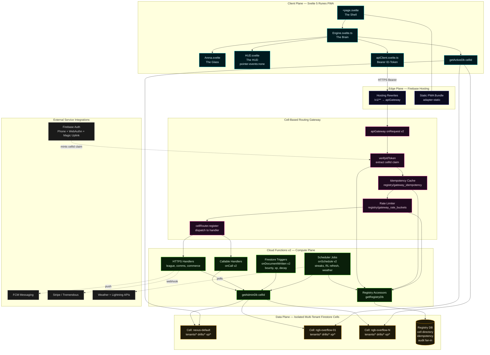

# NEXUS COMMAND — Master Software Architecture

**Status:** Canonical / Source of Truth
**Companion documents:** [`ROADMAP.md`](../ROADMAP.md), [`PERSONA_ECOSYSTEM.md`](./PERSONA_ECOSYSTEM.md), [`.cursorrules`](../.cursorrules), [`CELLS.md`](./CELLS.md), [`CELL_ROUTING.md`](./CELL_ROUTING.md), [`RL_ADAPTIVE_WORKOUTS.md`](./RL_ADAPTIVE_WORKOUTS.md), [`SPORTS_CONFIGS.md`](./SPORTS_CONFIGS.md)

> This document defines the immutable architectural perimeter for the Nexus Command platform. Any feature, refactor, or new module must conform to the boundaries described here. Drift away from these contracts is treated as a defect, not a deviation.

---

## 1. High-Level System Architecture

Nexus Command is a four-tier, cell-isolated, multi-tenant SaaS platform composed of:

1. **Client Plane** — Svelte 5 (Strict Runes) + SvelteKit, statically adapted, served as a PWA.
2. **Edge Plane** — Firebase Hosting rewrites + the `apiGateway` Cloud Function acting as the **Cell-Based Routing** layer.
3. **Compute Plane** — Cloud Functions for Firebase **v2** (HTTPS, Callable, Firestore triggers, scheduled jobs) executing all privileged business logic.
4. **Data Plane** — Multiple **isolated multi-tenant Firestore cells**, each a physically distinct Firestore database identified by a `cellId`, plus a default *registry* database that holds cross-cell metadata only.

The architecture is engineered around five non-negotiable invariants from `.cursorrules`:

- **Zero-Liability PII** — privileged data never crosses a cell boundary unless explicitly minted by a Cloud Function with admin context.
- **Strict Tenant Isolation** — every Firestore read/write is keyed by `tenantId` (or `clubId`) inside a `cellId`-scoped database.
- **Lazy (Read-Repair) Migrations** — destructive migrations are forbidden; missing keys are patched in-memory and merged asynchronously with `{ merge: true }`.
- **Vanguard Trinity Pattern** — every interactive screen fractures into Shell / Brain / Glass / HUD (see §3).
- **Hybrid Data Model** — the UI renders Synthetic Authored Nodes; the backend persists the raw Drill-as-Node Competency Knowledge Graph (see §4).

### 1.1 Layer Responsibilities

| Layer | Component | Purpose | Identity / Isolation Key |
| ----- | --------- | ------- | ------------------------ |
| **Client (Svelte 5 Runes)** | `+page.svelte`, `*Engine.svelte.ts`, `*Arena.svelte`, `*HUD.svelte` | Render UI, hold reactive `$state`/`$derived`/`$effect` graphs, dispatch authenticated requests | Firebase Auth ID Token (carries `tenantId`, `cellId`, `role` custom claims) |
| **Firebase Hosting** | `firebase.json` rewrites | Terminates HTTPS, serves the static PWA, rewrites `/v1/**` to the gateway function | URL path |
| **Cell-Based Routing Gateway** | `functions/apiGateway.js`, `functions/cellRouter.js` | Verifies ID token, resolves the caller's `cellId`, applies idempotency + rate limiting, dispatches to a registered handler with a cell-bound Firestore handle | `request.auth.token.cellId` |
| **Cloud Functions v2** | Domain handlers under `functions/src/**`, plus triggers (`onWritten`, `onCall`, `onSchedule`) | Execute privileged mutations, RL workout generation, COPPA verification, bounty escrow, weather aegis, league rollups | Service Account + minted admin context |
| **Firestore Cells** | `cells/{cellId}` databases (one per large NGB / overflow shard) plus the default registry DB | Persist tenant-scoped operational data; isolate "noisy neighbors" so a single league cannot throttle others | `cellId` (database) → `tenantId` (collection prefix) |
| **Registry DB** | Default Firestore database | Stores cross-cell mappings only (cell directory, gateway idempotency, rate buckets, audit log fan-in) | Global, write-restricted to admin context |

### 1.2 Cell-Based Routing Contract

The routing layer exists to eliminate cross-tenant blast radius. The contract is:

1. The client never selects a cell. The `cellId` is **issued by the backend** as a custom claim and embedded in the Firebase ID token.
2. `getActiveDb()` on the client and `getAdminDb(cellId)` on the server are the **only** sanctioned accessors. Direct `getFirestore()` calls are prohibited outside `firebase.js` / `cellRouter.js`.
3. The gateway function (`/v1/**`) is the **single ingress** for all privileged operations. Direct client → Firestore writes are restricted to read-only or self-scoped documents enforced by `firestore.rules`.
4. New cells are provisioned by `cellProvisioning.js`; tenants are migrated between cells by `cellMigration.js` using lazy read-repair — never destructive deletes.
5. Observability (`cellObservability.js`) emits per-cell SLO metrics; an oversaturated cell triggers automated overflow shard creation rather than throttling neighbors.

### 1.3 Cloud Functions v2 Integration Interfaces

All server-side interfaces resolve to one of four shapes:

| Interface | Trigger | Caller | Cell Resolution | Example |
| --------- | ------- | ------ | --------------- | ------- |
| **HTTPS Gateway** | `onRequest` (v2) behind `/v1/**` rewrite | Client `apiClient.svelte.ts` | Token claim `cellId` | League fixtures, broadcast messaging |
| **Callable** | `onCall` (v2) | Client SDK callable | Token claim `cellId` | Invite consumption, COPPA email send |
| **Firestore Trigger** | `onDocumentWritten` (v2) | Firestore document mutation | Path-derived `cellId` (resource match) | Bounty verification, XP rollups, decay |
| **Scheduler** | `onSchedule` (v2) | Cloud Scheduler | Iterates the cell registry | Daily streak decay, weather aegis sweeps, RL plan refresh |

All four shapes obtain their Firestore handle exclusively through `getAdminDb(cellId)` and the registry through `getRegistryDb()`.

---

## 2. System Topology — Mermaid Diagram



---

## 3. The Vanguard Trinity Pattern (UI Architecture)

> Every interactive screen in Nexus Command **must** fracture into four cooperating files. The pattern is named the "Trinity" because the three visual layers (Shell, Glass, HUD) are driven by a single source of reactive truth (Brain). Mixing responsibilities across these files is a hard architectural violation.

### 3.1 The Four Members

| Member | File Convention | Layer | Owns | Forbidden From |
| ------ | --------------- | ----- | ---- | -------------- |
| **The Shell** | `+page.svelte` | Mounting | Fixed layout container, route-level `data` props, instantiating exactly one Brain, mounting Glass + HUD as children | Holding business state, performing Firestore reads, computing derived gameplay values |
| **The Brain** | `[Name]Engine.svelte.ts` | State machine | All `$state`, `$derived`, `$effect` runes; subscriptions to `getActiveDb()`; cell-aware mutations via `apiClient`; pure TypeScript logic and computed selectors | Containing JSX/markup, importing component files, touching the DOM |
| **The Glass** | `[Name]Arena.svelte` | Presentation | The pixel-accurate world: SVG/Canvas/WebGL pitch, tactical board, skill-tree hex graph, particle effects, drag-and-drop hit targets | Mutating state directly (must call Brain methods), holding any private reactive state beyond ephemeral animation locals |
| **The HUD** | `[Name]HUD.svelte` | Overlay | Tailwind chrome: KPIs, action buttons, modals, toasts, telemetry readouts. **Root container MUST be `tw-pointer-events-none`** so the Glass underneath remains interactive | Blocking pointer events on the root; nested interactive controls re-enable with `tw-pointer-events-auto` only on themselves |

### 3.2 Data & Control Flow

```
┌──────────────────────────────────────────────────────────────────┐
│  +page.svelte (The Shell)                                        │
│  • const engine = new TacticalEngine();                          │
│  • <TacticalArena {engine} />   <TacticalHUD {engine} />         │
└────────────┬─────────────────────────────┬───────────────────────┘
             │                             │
             ▼                             ▼
   ┌──────────────────┐           ┌──────────────────┐
   │ TacticalArena    │  reads    │ TacticalHUD      │
   │ (The Glass)      │ ◀────────▶│ (pointer-events  │
   │ canvas / svg     │           │  -none root)     │
   └────────┬─────────┘           └────────┬─────────┘
            │ method calls                 │ method calls
            ▼                              ▼
   ┌──────────────────────────────────────────────────┐
   │ TacticalEngine.svelte.ts (The Brain)             │
   │ • $state board, tokens, routes                   │
   │ • $derived metrics, threat, formation            │
   │ • $effect → onSnapshot(getActiveDb())            │
   │ • async commit() → apiClient.post('/v1/...')     │
   └──────────────────────────────────────────────────┘
```

### 3.3 Strict HUD Pointer-Events Rules

The HUD overlays the Glass at full viewport. To preserve direct manipulation of the underlying interactive surface (drag tokens, draw routes, scrub timeline), the HUD obeys these rules without exception:

1. **The HUD root element is `tw-pointer-events-none`.** No exceptions.
2. **Only leaf interactive elements re-enable pointer events** with `tw-pointer-events-auto` (e.g. a single button, a popover surface, a drag handle).
3. **Hit-targeted regions of the HUD use Tailwind island wrappers**, never a parent that re-enables a whole panel.
4. **Modal scrims** that intentionally block the Glass must be siblings of the HUD root, not descendants, and explicitly toggle `tw-pointer-events-auto` on a dedicated scrim layer owned by the Brain.
5. **`$effect` blocks calling `goto()`** for HUD-driven navigation must wrap the call in `untrack(() => goto(...))` to prevent infinite reactive loops.

### 3.4 Trinity Compliance Checklist

A new screen is only Trinity-compliant when **all** of the following are true:

- [ ] Exactly one `+page.svelte` Shell, instantiating exactly one `*Engine.svelte.ts` Brain.
- [ ] Brain file uses **only** Svelte 5 runes (`$state`, `$derived`, `$effect`); no Svelte 4 stores (`writable`/`readable`).
- [ ] Glass component receives the Brain via props and never imports Firestore SDK.
- [ ] HUD root element carries `tw-pointer-events-none`; interactive descendants opt-in with `tw-pointer-events-auto`.
- [ ] All Tailwind classes use the mandatory `tw-` prefix.
- [ ] Any navigation inside an `$effect` is wrapped in `untrack()`.
- [ ] Brain's Firestore handle is acquired via `getActiveDb()` (cell-aware), never `getFirestore()` directly.

### 3.5 Reference Implementations

| Screen | Shell | Brain | Glass | HUD |
| ------ | ----- | ----- | ----- | --- |
| Coach Tactical War-Room | `routes/(app)/coach/tactical/+page.svelte` | `lib/components/coach/TacticalEngine.svelte.ts` | `TacticalArena.svelte` | `TacticalHUD.svelte` |
| Player Armory | `routes/(app)/player/armory/+page.svelte` | `lib/states/ArmoryEngine.svelte.ts` | `ArmoryArena.svelte` | `ArmoryHUD.svelte` |
| Cartridge Simulator | `routes/(app)/coach/match-day/+page.svelte` | `lib/states/SimulatorEngine.svelte.ts` | `SimulatorArena.svelte` | `SimulatorHUD.svelte` |

---

## 4. The Hybrid Data Model

> The frontend's job is to keep an athlete *psychologically engaged*. The backend's job is to keep a Reinforcement Learning policy *mathematically convergent*. Those are different shapes of truth, and Nexus Command stores both.

### 4.1 Two Truths, One Pipeline

Nexus Command operates on two parallel representations of the curriculum:

| Representation | Lives In | Cardinality | Semantic | Consumer |
| -------------- | -------- | ----------- | -------- | -------- |
| **Synthetic Authored Nodes** | Frontend skill tree, `armory`, `passport`, HUD readouts | ~50–150 nodes per sport | Coarse, human-meaningful action *abstractions* — "Pace", "Vision", "First Touch", "Aerial Duel" | Players, parents, coaches (UI only) |
| **Drill-as-Node Competency Knowledge Graph** | Backend Firestore collections inside each cell | 5,000+ raw drill nodes per sport, plus edges | Atomic, machine-meaningful drills, prerequisites, mastery edges, and observed transitions | RL planner, mastery rollups, telemetry |

The Synthetic layer is a **projection** of the underlying competency graph. The mapping is many-to-many: one synthetic node ("Pace") rolls up many drill nodes ("10m sprint", "shuttle 5-10-5", "reactive sprint to whistle"); one drill node may reinforce multiple synthetic nodes.

### 4.2 Why the Split Exists

1. **UI cognitive load.** Showing 5,000 drills in a skill tree induces paralysis and shame. The Octalysis "Fog of War" works only on a tractable graph of authored abstractions.
2. **RL convergence.** Reinforcement Learning over primitive actions has catastrophic state-action explosion. Operating in the space of action abstractions is *mathematically required* for the planner to converge on optimal training paths within a realistic compute budget. This is captured in [`RL_ADAPTIVE_WORKOUTS.md`](./RL_ADAPTIVE_WORKOUTS.md).
3. **Multi-sport scaling.** Synthetic nodes are sport-agnostic categories; the underlying drill graph is swapped per `sportId` from `sports_configs`. The UI does not change shape when the platform onboards basketball or volleyball.
4. **Decay & loss-avoidance.** Skill decay (Octalysis Core Drive 8) operates on synthetic XP buckets so users see a single, intuitive "Pace dropped 4%" alert instead of 47 micro-decay events.

### 4.3 Layer Responsibilities

```
┌────────────────────────────────────────────────────────────────────┐
│ FRONTEND (The Glass + HUD render this)                             │
│  • Synthetic Authored Nodes  — abstract skill axes                 │
│  • Composite Snowflake hex tree, Fog of War masks                  │
│  • Per-axis XP, mastery tier, decay countdown                      │
│  • Read-only projection — never authored from the client           │
└──────────────────────────────────▲─────────────────────────────────┘
                                   │ projection (read model)
                                   │ materialized by CF v2 triggers
┌──────────────────────────────────┴─────────────────────────────────┐
│ BACKEND (Cloud Functions v2 own this, per cell)                    │
│  • Drill-as-Node Competency Knowledge Graph                        │
│      nodes:  drill_nodes/{drillId}                                 │
│      edges:  drill_edges/{drillId}__{drillId}  (prereq, transfer)  │
│  • Observed telemetry: reps/, workouts/, mastery_events/           │
│  • RL policy state: rl_policy/{playerId}                           │
│  • Synthetic projection cache: synthetic_axes/{playerId}/{axisId}  │
└────────────────────────────────────────────────────────────────────┘
```

### 4.4 Authoring & Mutation Rules

- **Frontend writes are forbidden against `drill_nodes`, `drill_edges`, and `rl_policy`.** Those collections are mutated exclusively by Cloud Functions v2 (curriculum publishing, RL tick, mastery rollup).
- **Frontend writes target raw telemetry only** — `reps/`, `workouts/`, `streaks/`, `cv_verified_drill/` — always via `getActiveDb()` and always `tenantId`-scoped.
- **Synthetic projections are never authored by the client.** A Firestore trigger (`onDocumentWritten` over `reps/{repId}`) recomputes the affected `synthetic_axes/{playerId}/{axisId}` doc and increments XP atomically.
- **Lazy read-repair** is the only sanctioned migration: on read, if `sportId` / `schemaVersion` / `tenantId` are missing, patch in memory and queue a non-blocking `{ merge: true }` write.

### 4.5 RL Convergence Loop

```
 telemetry  ──▶  drill_nodes (raw)  ──▶  RL policy update  ──▶
   reps/         (per cell)             rl_policy/{playerId}
                                                │
                                                ▼
                                  next prescribed drill set
                                                │
                                                ▼
                              synthetic_axes projection refresh
                                                │
                                                ▼
                            Frontend skill-tree HUD re-renders
                            (synthetic nodes only — abstractions)
```

The loop closes once per workout commit. The RL planner never exposes raw drill IDs to the UI; it returns a `prescribedWorkout` payload whose human-readable labels are resolved through the synthetic mapping.

### 4.6 Compliance with the Defense Protocol

The Hybrid Data Model preserves every invariant in `.cursorrules`:

- **Zero Data Loss** — the raw drill graph is append-only; synthetic projections are recomputable derivatives.
- **Strict Tenant Isolation** — both representations live inside the caller's `cellId` database, scoped by `tenantId`.
- **Anti-Deletion** — synthetic projections may be re-materialized at any time; raw telemetry is never dropped.
- **Lazy Migration** — schema upgrades to drill nodes patch on read and merge asynchronously.
- **Cell-Based Routing** — all reads/writes go through `getActiveDb()` (client) or `getAdminDb(cellId)` (server).

---

## 5. Architectural Boundaries (Quick Reference)

| Concern | Sanctioned Path | Forbidden |
| ------- | --------------- | --------- |
| Firestore handle (client) | `getActiveDb()` | `getFirestore()` outside `firebase.js` |
| Firestore handle (server) | `getAdminDb(cellId)` / `getRegistryDb()` | `admin.firestore()` outside `cellRouter.js` |
| Privileged write | `apiClient` → `/v1/**` → gateway → handler | Direct client write to privileged collections |
| UI state | `*Engine.svelte.ts` runes | Svelte 4 stores, ad-hoc module-level `let` |
| UI markup | Glass + HUD components | Markup inside Engine files |
| HUD interactivity | Leaf `tw-pointer-events-auto` only | Re-enabling on the HUD root |
| Navigation in `$effect` | `untrack(() => goto(...))` | Bare `goto()` inside `$effect` |
| Drill graph mutation | CF v2 trigger / scheduled job | Any client SDK write |
| Synthetic axis mutation | CF v2 projection trigger | Any client SDK write |
| Cell selection | Backend-issued JWT claim | Client-supplied `cellId` parameter |
| Schema migration | Lazy read-repair + `{ merge: true }` | Destructive backfill / key drop |
| Tailwind class | `tw-` prefixed | Unprefixed utility classes |

---

## 6. Change Control

Any pull request that:

- introduces a new top-level route,
- adds a new Cloud Function v2 entry point,
- creates a new Firestore collection or alters a cell boundary,
- or alters the Trinity contract for an existing screen,

**must** update this document in the same commit. Drift between code and `ARCHITECTURE.md` is treated as a regression and blocks merge.
