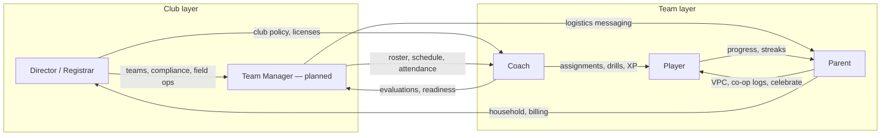

# SSTracker — Persona Ecosystem

**North star:** An addictive, age-appropriate training/gaming HUD for players, with seamless handoffs across parent, coach, team operations, and club administration — all tenant-isolated and compliance-first.

## Document roles

| Doc | Purpose |
|-----|---------|
| [`docs/vision/PLATFORM_BUILD_MANDATES.md`](./vision/PLATFORM_BUILD_MANDATES.md) | **Build contract** — accepted vs rejected UX mandates (supersedes enterprise PDF visuals for Player OS) |
| [`docs/vision/PLAYER_OS_INSTRUMENT_TAXONOMY.md`](./vision/PLAYER_OS_INSTRUMENT_TAXONOMY.md) | **Player instrument types** — cohesion (shared frame) vs differentiation (inner primitive) |
| [`docs/vision/AGENT_PLAYER_UX_SPRINT_TEMPLATE.md`](./vision/AGENT_PLAYER_UX_SPRINT_TEMPLATE.md) | **Player UX sprint procedure** — mandatory fields + build prompt |
| [`docs/vision/PLATFORM_EXPERIENCE_RUBRIC.md`](./vision/PLATFORM_EXPERIENCE_RUBRIC.md) | **Platform pass/fail criteria** — universal premium experience bar (all personas) |
| [`ROADMAP.md`](../ROADMAP.md) | **When** to build — sprint status, proof tests, file lists |
| [`docs/vision/`](./vision/) | **Why / how it should feel** — persona UX north stars |
| [`docs/ARCHITECTURE.md`](./ARCHITECTURE.md) | **System design** — cells, Trinity pattern, data model |
| This file | **Who** uses what — roles, routes, handoffs |

---

## Role overview

| Role | Status | Scope | UX skin | Primary route |
|------|--------|-------|---------|---------------|
| **Player** | Shipped | Training HUD, missions, XP, armory, capsules | Operative command deck — cinematic void + emissive HUD (not flat dossier admin) | `/player/dashboard` |
| **Parent** | Shipped | VPC, household, co-op logging, bounties, payments | Flat co-op partner — not a game UI | `/parent/dashboard` |
| **Coach** | Shipped | Development, drills, assignments, match-day, scouting | Flat sideline analytics — no gamification | `/coach` |
| **Team Manager** | Planned | Roster ops, scheduling, registration coordination, attendance | Flat ops dashboard (coach-like density) | `/team-manager` (future) |
| **Registrar** | Shipped (migrating) | Club-wide registration & compliance matrix | Director tab UX | `/director?tab=registrars` |
| **Director** | Shipped | Club mission control — compliance, field ops, licenses | Enterprise command center | `/director` |
| **Admin** | Shipped | Platform orgs, users, system settings | Admin console | `/admin` |
| **Recruiter** | Future | Scouting portal, tokenized player cards | Recruiter terminal (TBD) | `/recruiter` |
| **Tutor** | Future | Supplemental 1:1 instruction | Tutor workspace (TBD) | `/tutor` |

Planned JWT roles (`team_manager`, expanded `recruiter`/`tutor`) are documented only — see [`ROADMAP.md`](../ROADMAP.md) and vision stubs.

---

## Persona detail

### Player

- **Scope:** Daily missions, streaks, XP, skill tree / armory, memory capsules, coach-assigned bounties. Operative loadout → Epic 3 ([`OPERATIVE_LOADOUT.md`](./vision/OPERATIVE_LOADOUT.md)); collectible ID card zones → [`OPERATIVE_ID_CARD.md`](./vision/OPERATIVE_ID_CARD.md) (recruit/public front matches Player card grammar; no team name on Z2).
- **UX:** Operative command deck — 12-column liquid bento inside `OperativeHub`; sparse void, emissive geometry, glass data layers; secondary nav via shell rail. HQ bands are classified **instruments** (Identity, Directive, Navigation, Progression, Telemetry, Execute) with one shared `pd-os-deck` frame — see [`PLAYER_OS_INSTRUMENT_TAXONOMY.md`](./vision/PLAYER_OS_INSTRUMENT_TAXONOMY.md). Premium cinematic track **2.12.1–2.19 Done** — Epic 3.4 / 4.1 **unblocked after 2.19 Done** (sign-off still required). Player OS target = operative command deck, not flat dossier admin. **Enterprise PDF visuals ≠ Player void canon** — see [`PLATFORM_BUILD_MANDATES.md`](./vision/PLATFORM_BUILD_MANDATES.md).
- **Vision:** [`docs/vision/PLAYER_OS.md`](./vision/PLAYER_OS.md)
- **Experience criteria:** [`PLATFORM_EXPERIENCE_RUBRIC.md`](./vision/PLATFORM_EXPERIENCE_RUBRIC.md) §2 — Player row

### Parent

- **Scope:** Verifiable Parental Consent (VPC), household provisioning, co-op workout logging, Car Ride debrief, bounty terminal, billing visibility.
- **UX:** Partner/coach-in-the-car — supportive, not gamified. Uses flat **Directive + Telemetry** instrument subset only (no Player `pd-os-deck` frame or gamification chrome).
- **Vision:** [`docs/vision/PARENT_OS.md`](./vision/PARENT_OS.md)
- **Experience criteria:** [`PLATFORM_EXPERIENCE_RUBRIC.md`](./vision/PLATFORM_EXPERIENCE_RUBRIC.md) §2 — Parent row

### Coach

- **Scope:** Squad telemetry, drill assignment, tactical board, Forge, match-day, scouting evaluations — **development and tactics**.
- **UX:** High-density flat analytics (`SquadTelemetryView`, mono tables). **Telemetry + Execute** instrument subset — flat sideline skin; no Player navigation tiles or void deck frame.
- **Vision:** [`docs/vision/COACH_OS.md`](./vision/COACH_OS.md)
- **Experience criteria:** [`PLATFORM_EXPERIENCE_RUBRIC.md`](./vision/PLATFORM_EXPERIENCE_RUBRIC.md) §2 — Coach row

### Team Manager (planned)

- **Scope:** Roster operations, practice/event scheduling, registration coordination, attendance, logistics messaging — **not** drill/XP assignment or tactical tools. Comms delivery absorbed into **Epic 4** ([`COMMS_HUB.md`](./vision/COMMS_HUB.md) Sprint 4.7).
- **UX:** Ops dashboard; audit trail with `actorRole: team_manager`.
- **Clearance:** Background check required (minor PII for roster/scheduling).
- **Vision:** [`docs/vision/TEAM_MANAGER_OS.md`](./vision/TEAM_MANAGER_OS.md)
- **Experience criteria:** [`PLATFORM_EXPERIENCE_RUBRIC.md`](./vision/PLATFORM_EXPERIENCE_RUBRIC.md) §2 — Team Manager row

### Registrar → Director

- **Scope:** Club-wide compliance matrix, registrar invites, roster compliance — consolidating into Director OS.
- **Route:** `/director?tab=registrars`; legacy `/registrar` redirecting for eligible roles.
- **Migration:** [`docs/REGISTRAR_DIRECTOR_MIGRATION.md`](./REGISTRAR_DIRECTOR_MIGRATION.md)
- **Vision (Director):** [`docs/vision/DIRECTOR_OS.md`](./vision/DIRECTOR_OS.md)

### Director

- **Scope:** Multi-team club ops, field ops, licenses, household compliance, deployment calendar (in progress).
- **Build status:** [`docs/EPIC5_STATUS.md`](./EPIC5_STATUS.md) — **Epic 5 here = Enterprise Logistics**, not lettered Product Epic E in ROADMAP.
- **Experience criteria:** [`PLATFORM_EXPERIENCE_RUBRIC.md`](./vision/PLATFORM_EXPERIENCE_RUBRIC.md) §2 — Director row

### Admin

- **Scope:** Organizations, users, impersonation, system settings, sports configs.
- **Vision:** [`docs/vision/ADMIN_OS.md`](./vision/ADMIN_OS.md)
- **Experience criteria:** [`PLATFORM_EXPERIENCE_RUBRIC.md`](./vision/PLATFORM_EXPERIENCE_RUBRIC.md) §2 — Admin row

### Recruiter / Tutor (future)

- **Scope:** External scouting and supplemental instruction; clearance-gated per [`docs/CLEARANCE.md`](./CLEARANCE.md).
- **Vision:** [`docs/vision/RECRUITER_OS.md`](./vision/RECRUITER_OS.md), [`docs/vision/TUTOR_OS.md`](./vision/TUTOR_OS.md)
- **Experience criteria:** [`PLATFORM_EXPERIENCE_RUBRIC.md`](./vision/PLATFORM_EXPERIENCE_RUBRIC.md) §2 — Recruiter / Tutor row

---

## Handoff diagram

**Return paths:** Parents escalate billing/compliance to Director; coaches feed readiness back to Team Manager; players surface mission completion to coaches via bounty/assignment flows.

---

## Vision documents

| Doc | Persona |
|-----|---------|
| [`docs/vision/PLAYER_OS.md`](./vision/PLAYER_OS.md) | Player |
| [`docs/vision/OPERATIVE_LOADOUT.md`](./vision/OPERATIVE_LOADOUT.md) | Player — loadout & Armory (Epic 3) |
| [`docs/vision/COMMS_HUB.md`](./vision/COMMS_HUB.md) | Comms hub — all personas (Epic 4) |
| [`docs/vision/PARENT_OS.md`](./vision/PARENT_OS.md) | Parent |
| [`docs/vision/COACH_OS.md`](./vision/COACH_OS.md) | Coach |
| [`docs/vision/TEAM_MANAGER_OS.md`](./vision/TEAM_MANAGER_OS.md) | Team Manager |
| [`docs/vision/DIRECTOR_OS.md`](./vision/DIRECTOR_OS.md) | Director |
| [`docs/vision/ADMIN_OS.md`](./vision/ADMIN_OS.md) | Admin |
| [`docs/vision/RECRUITER_OS.md`](./vision/RECRUITER_OS.md) | Recruiter |
| [`docs/vision/TUTOR_OS.md`](./vision/TUTOR_OS.md) | Tutor |

---

## Related specs

| Spec | Topic |
|------|-------|
| [`docs/COPPA_SIGNUP_MATRIX.md`](./COPPA_SIGNUP_MATRIX.md) | Age gating, VPC, operative login |
| [`docs/FCM_AND_MESSAGING_MATRIX.md`](./FCM_AND_MESSAGING_MATRIX.md) | Push inventory; full product → Epic 4 |
| [`docs/vision/COMMS_HUB.md`](./vision/COMMS_HUB.md) | Comms hub north star (Epic 4) |
| [`docs/SAFESPORT_COMMS_MATRIX.md`](./SAFESPORT_COMMS_MATRIX.md) | SafeSport control map (Epic 4) |
| [`docs/EPIC5_STATUS.md`](./EPIC5_STATUS.md) | Director logistics build audit |
| [`docs/CLEARANCE.md`](./CLEARANCE.md) | Background check roles & JWT gate |
| [`docs/REGISTRAR_DIRECTOR_MIGRATION.md`](./REGISTRAR_DIRECTOR_MIGRATION.md) | Registrar → Director consolidation |

---

## Agent quick reference

- **Delivery:** [`ROADMAP.md`](../ROADMAP.md) current sprint + [`.cursor/rules/sst-agent-workflow.mdc`](../.cursor/rules/sst-agent-workflow.mdc)
- **Player HUD files:** [`.cursor/rules/sst-player-dashboard.mdc`](../.cursor/rules/sst-player-dashboard.mdc)
- **Invariants:** [`.cursorrules`](../.cursorrules)
