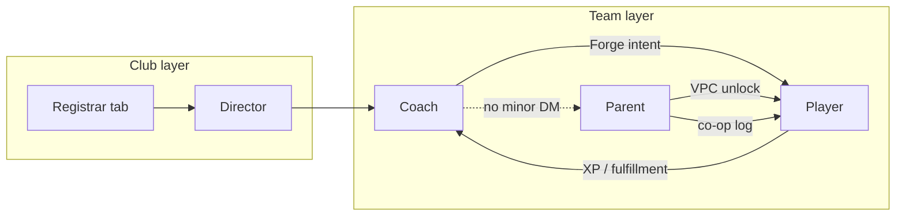

# SSTracker — Persona Diligence Matrix

**Purpose:** Acquirer-facing consolidation of persona purpose, capabilities, and demo scope.  
**Authority:** [`PERSONA_ECOSYSTEM.md`](../PERSONA_ECOSYSTEM.md) + vision `*_OS.md` — those files remain canonical; this doc does not replace them.  
**Last updated:** 2026-05-22 · ACQ-QA-DOC-SYNC

---

## Summary matrix

| Persona | Status | UX skin | Exec cut? |
|---------|--------|---------|-----------|
| Player | Shipped | Gaming HUD / operative command deck | **Yes** |
| Parent | Shipped | Flat co-op partner | **Yes** |
| Coach | Shipped | Flat sideline analytics | **Yes** |
| Director | Shipped | Enterprise command center | Optional (Act 4) |
| Registrar | Shipped (migrating) | Director tab UX | Optional |
| Admin | Shipped | Admin console | No |
| Team Manager | Planned | Flat ops dashboard | No |
| Recruiter | Future | Recruiter terminal (TBD) | No |
| Tutor | Future | Tutor workspace (TBD) | No |

---

## Player

### Purpose

Daily training engagement — missions, XP, streaks, coach-assigned bounties, telemetry. The addictive surface incumbents lack.

### Primary user

Youth athletes (and teen/adult club players) logging training and fulfilling coach prescriptions.

### UX skin

**Operative command deck** — cinematic void, emissive HUD, `pd-os-deck` frame. **Not** flat admin UI. See [`PLAYER_OS_FOUNDATION.md`](../vision/PLAYER_OS_FOUNDATION.md).

### Vision north star

Deliver an addictive, fluid training/gaming HUD that works for all ages with age-appropriate tone and rewards. HQ must feel like mission control — clear next action and satisfying progress without exploitative mechanics for minors. ([`PLAYER_OS.md`](../vision/PLAYER_OS.md))

### Capabilities — shipped (Tier 1)

| Route | workflow_id |
|-------|-------------|
| `/player/dashboard` | `WF-PLAYER-HQ` |
| `/player/workout` | `WF-PLAYER-TRAIN` |
| `/stats` | `WF-PLAYER-STATS` |
| `/vpc-pending` | `WF-VPC-GATE` |

**Owner-verified (2026-05-22):** Mission accept → Train handoff (QA-151, GP-ACQ-04a→04b); Train volume controls sets/reps/bilateral (QA-103–105).

### Capabilities — partial

- RL adaptive homework on HQ — heuristic default (`abPercent: 0`)
- Armory / skill tree — Tier 2/3; avatar PNG deferred

### Capabilities — planned

- Operative loadout PNG layers (post-launch)
- Full RL policy rollout
- Cross-sport configs beyond soccer QA tenant

### Key data / callables

| Type | Names |
|------|-------|
| **Callables** | `logTrainingSession`, `submitCompletionProof` |
| **Collections** | `team_assignments`, `drill_completions`, `player_stats`, `users` |
| **Components** | `IdentityBentoModule`, `OperativeHub`, `ActiveBounties`, `VanguardProtocolPanel` |

### Handoffs

| To | Flow |
|----|------|
| **Coach** | Fulfill Forge intents → XP visible on coach telemetry |
| **Parent** | VPC gate blocks until parent grants consent; progress visible to household |

### Acquisition demo

**Yes** — GP-ACQ steps 4a–4b (HQ + Train); 4c `/stats` waivable in 15-min cut.

---

## Parent

### Purpose

Co-op partner — VPC, household provisioning, co-op logging, proof review, payments visibility. Not a game UI.

### Primary user

Guardians of minor (and teen) players: VPC signers, household admins, car-ride debriefers.

### UX skin

**Flat co-op partner** — Directive + Telemetry instrument subset only. No Player `pd-os-deck` or gamification chrome. [`PARENT_OS_FOUNDATION.md`](../vision/PARENT_OS_FOUNDATION.md)

### Vision north star

Parents are co-op partners, not spectators. Easy consent, log alongside athlete, fund club obligations, celebrate progress — without pretending to be a game. ([`PARENT_OS.md`](../vision/PARENT_OS.md))

### Capabilities — shipped (Tier 1)

| Route | workflow_id |
|-------|-------------|
| `/parent/household` | `WF-PARENT-HOUSEHOLD` |
| `/parent/vpc` | `WF-PARENT-VPC` |
| `/parent/dashboard` | `WF-PARENT-COOP` |

### Capabilities — partial

- `/parent/log-workout` (Tier 2) — co-op log; parent JWT `householdId` sync risk
- `/parent/payments` (Tier 2) — Stripe path shipped; production billing sign-off pending
- Proof review queue — shipped; edge cases under owner QA

### Capabilities — planned

- Native push parity with store binaries
- Enhanced Car Ride / debrief prompts

### Key data / callables

| Type | Names |
|------|-------|
| **Callables** | `parentSignCoppaWaiver`, `parentGrantVpcConsent`, `parentReviewCompletionProof`, `logTrainingSession` (co-op) |
| **Collections** | `households`, `consent_records`, `bounties` |

### Handoffs

| To | Flow |
|----|------|
| **Player** | VPC unlock; co-op logs count toward XP |
| **Coach** | Announcements via SafeSport broadcast — no unsupervised DM to minor |

### Acquisition demo

**Yes** — GP-ACQ steps 1–2, 5 (household, VPC, dashboard).

---

## Coach

### Purpose

Development loop — squad telemetry, Forge intent deploy, drill assignment, match-day tools. Zero gamification chrome.

### Primary user

Team coaches responsible for athlete development, session planning, match-day decisions.

### UX skin

**Flat sideline analytics** — high-density mono tables, Forge full-page workbench. Reject Trinity HUD overlay on Tier 1. [`COACH_OS_FOUNDATION.md`](../vision/COACH_OS_FOUNDATION.md)

### Vision north star

A flat, high-density sideline analytics workspace: roster readiness, drill assignment, match-day tools, and development tracking — zero gamification chrome. ([`COACH_OS.md`](../vision/COACH_OS.md))

### Capabilities — shipped (Tier 1)

| Route | workflow_id |
|-------|-------------|
| `/coach` | `WF-COACH-INTEL` |
| `/coach/forge` | `WF-COACH-FORGE` |
| `/compliance` | `WF-TRUST-COACH-CLEARANCE` |

### Capabilities — partial

- `/coach/drills` Field Station — Tier 2; spatial designer polish
- `/coach/tactical` War Room — Tier 2 hidden from nav
- Curriculum AI — not shipped

### Capabilities — planned

- Team Manager absorption of logistics messaging (Epic 4.7)
- Enhanced macrocycle tooling

### Key data / callables

| Type | Names |
|------|-------|
| **Callables** | `secureDeployIntent`, `secureCancelIntent`, `secureExtendIntent`, `safeSportBroadcast` |
| **Collections** | `team_assignments`, `teams`, `team_roster`, `drills` |

### Handoffs

| To | Flow |
|----|------|
| **Player** | Assignments → `ActiveBounties` → Train |
| **Parent** | Broadcasts + Parent Lounge — not direct minor DM |

### Acquisition demo

**Yes** — GP-ACQ step 3 (Forge deploy).

---

## Director

### Purpose

Club mission control — multi-team ops, compliance, field deployment, licenses, registrar workflows, tryouts.

### Primary user

Club directors, technical directors, registrars (consolidating into Director tabs).

### UX skin

**Enterprise command center** — tabbed `/director` shell, coach-like density without gamification.

### Vision north star

Club mission control — one surface for compliance, multi-team operations, field deployment, licenses, and registrar workflows at org scale. ([`DIRECTOR_OS.md`](../vision/DIRECTOR_OS.md))

### Capabilities — shipped

| Route | Tier | Notes |
|-------|------|-------|
| `/director` | 2 | Tab shell — teams, compliance, registrars, field ops |
| `/director/compliance` | 2 | Staff clearance audit |
| Tryout public routes | 2 | `/tryouts/{programId}` |
| Registration public | 2 | `/register/{clubId}` |

### Capabilities — partial

- Federation CSV export — not 38-body API
- Tournament brackets — single/double-elim shipped; polish remains
- Field ops deployment calendar — scaffold

### Capabilities — planned

- Full registrar decommission of legacy `/registrar`
- Federation Phase 4 API (owner GTM)

### Key data / callables

| Type | Names |
|------|-------|
| **Callables** | `upsertTryoutProgram`, `promoteTryoutToRoster`, `upsertClubEligibilityMatrix`, `exportStateRoster`, `assignSeasonRegistrationToRoster` |
| **Collections** | `tryout_programs`, `clubs`, `eligibility_matrix` |

### Handoffs

| To | Flow |
|----|------|
| **Coach** | Teams provisioned → coach takes development loop |
| **Registrar tab** | Registration → roster assign |

### Acquisition demo

**Optional** — Full demo Act 4 (tryout lifecycle); not required for 15-min exec cut.

---

## Registrar

### Purpose

Club-wide registration and compliance matrix — **consolidating into Director OS** as a tab, not a separate product.

### Primary user

Club registrars managing season registration, compliance holds, roster compliance.

### UX skin

Director tab UX — `/director?tab=registrars`; legacy `/registrar` redirecting.

### Vision north star

Same as Director registrar subsection — compliance matrix parity, invite flows, migration from standalone registrar console. ([`REGISTRAR_DIRECTOR_MIGRATION.md`](../REGISTRAR_DIRECTOR_MIGRATION.md))

### Capabilities — shipped

- Registrar invite tab on Director
- Registration → roster assign (`assignSeasonRegistrationToRoster`)
- Eligibility matrix

### Capabilities — partial

- Drag-drop roster assign UX — Wave 4 shipped; edge cases
- Legacy `/registrar` route decommission pending

### Capabilities — planned

- Full Director tab parity sign-off

### Key routes

| Route | workflow_id |
|-------|-------------|
| `/director?tab=registrars` | — (Director shell) |

### Acquisition demo

**Optional** — Act 4 or diligence deep-dive only.

---

## Admin

### Purpose

Platform operators — organizations, users, impersonation, sports configs, RL policy toggles. Isolated from club Director day-to-day.

### Primary user

`super_admin` / platform operators.

### UX skin

**Admin console** — flat trust-form layout.

### Vision north star

Platform operators manage organizations, users, impersonation, and system-wide configuration — isolated from club Director day-to-day ops. ([`ADMIN_OS.md`](../vision/ADMIN_OS.md))

### Capabilities — shipped

| Route | Tier |
|-------|------|
| `/admin` | 3 |
| `/admin/rl-policy` | 3 |

### Capabilities — partial

- Cross-tenant audit exposure — policy-gated

### Capabilities — planned

- Expanded org provisioning automation

### Key data / callables

| Type | Names |
|------|-------|
| **Callables** | `createSportModule`, `upsertSportsConfig`, RL `setPolicyAbPercent` |
| **Collections** | `sports_configs`, `organizations`, `users` |

### Acquisition demo

**No** — internal ops only; mention sports_configs in multi-sport narrative.

---

## Team Manager (Planned)

### Purpose

Team operations — roster, schedule, registration coordination, attendance — **without** drill/XP assignment or tactical tools.

### Primary user

Club volunteers or paid staff running logistics for one or more teams.

### UX skin

Flat ops dashboard — coach-like density, different module set. **Not in JWT today.**

### Vision north star

Dedicated team operations persona with separate JWT role for auditability, without crossing into coach development/tactics tooling. ([`TEAM_MANAGER_OS.md`](../vision/TEAM_MANAGER_OS.md))

### Capabilities — shipped

None — role not in JWT.

### Capabilities — partial

- Coach `/coach/logistics` absorbs some ops messaging today

### Capabilities — planned

| Item | Notes |
|------|-------|
| `/team-manager` route | Future |
| `team_manager` JWT claim | Documented only |
| Background check clearance | Same as coach pipeline |
| Comms Epic 4.7 | Logistics messaging handoff |

### Acquisition demo

**No** — cite as post-close roadmap item.

---

## Recruiter (Future)

### Purpose

Clearance-gated scouting portal — tokenized player cards, compound search, export audit.

### Primary user

External recruiters with verified clearance and org-approved access.

### UX skin

Recruiter terminal (TBD) — `/recruiter` route exists as stub.

### Vision north star

A clearance-gated scouting portal for collegiate and elite recruiters: tokenized player cards, compound search, and export audit — without exposing minor PII beyond policy. ([`RECRUITER_OS.md`](../vision/RECRUITER_OS.md))

### Capabilities — shipped

- `/recruiter` route stub
- `getPublicRecruitProfile`, `recordRecruiterExport` defense patterns

### Capabilities — planned

Full search terminal, billing hooks, clearance workflow

### Acquisition demo

**No**

---

## Tutor (Future)

### Purpose

Supplemental 1:1 instruction — clearance-gated, SafeSport-aware, distinct from team coach.

### Primary user

Independent or club-affiliated tutors running extra sessions outside team practice.

### UX skin

Tutor workspace (TBD).

### Vision north star

Supplemental 1:1 instruction logged against player profiles — clearance-gated, SafeSport-aware, distinct from team coach and team manager personas. ([`TUTOR_OS.md`](../vision/TUTOR_OS.md))

### Capabilities — shipped

- `/tutor` route stub

### Capabilities — planned

Session log, scoped roster, coach read-only visibility

### Acquisition demo

**No**

---

## Handoff diagram (acquisition scope)

---

## Related documents

- [`PERSONA_ECOSYSTEM.md`](../PERSONA_ECOSYSTEM.md) — canonical role overview
- [`PRODUCT_SURFACE_REGISTRY.md`](../vision/PRODUCT_SURFACE_REGISTRY.md) — route tiers
- [`PLATFORM_WORKFLOW_CANON.md`](../vision/PLATFORM_WORKFLOW_CANON.md) — gold paths
- [`PRODUCT_STATE.md`](./PRODUCT_STATE.md) — shipped vs partial summary
