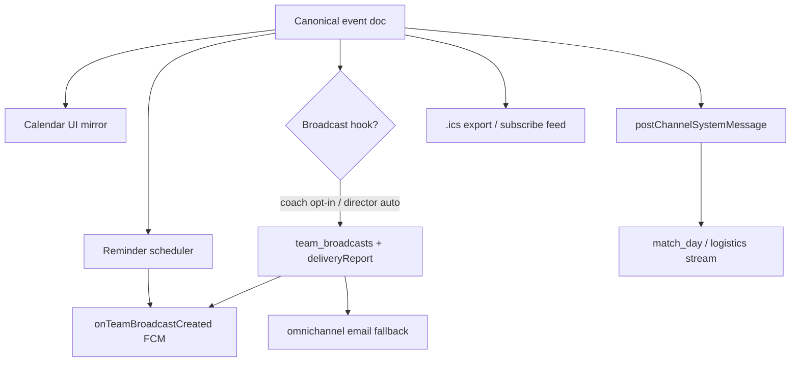

# Comms ↔ Calendar Integration

**Authority:** Event-driven comms fan-out · **Standards:** [`COMMS_PLATFORM_STANDARDS.md`](./COMMS_PLATFORM_STANDARDS.md) · **Shipped hooks:** Epic 4.5 schedule→broadcast, 4.6 reminders · **Surface:** Player HQ calendar + parent dashboard

---

## 1. Event canonical model

A **scheduled event** is the single source of truth for time, place, and team scope. Comms and calendar are **projections** of the event — not separate silos.

| Field domain | Canonical store (today) | Consumers |
|--------------|-------------------------|-----------|
| Team practice / workout | `team_workouts` | Calendar UI, `sendScheduledEventReminders`, optional `safeSportBroadcast` (4.5) |
| Match / fixture | `teams/{teamId}/fixtures` or deployment calendar entries | Match-day channel, `push_gameReminders`, HQ match-day band |
| Club deployment | `deployment_calendar` | Director auto-broadcast per team (4.5 `onDeploymentCalendarEntryCreated`) |
| Tryout session | Tryout program collections | `tryouts_events` channel system messages |

**Rule:** Editing the event updates calendar **and** triggers comms only through explicit hooks (create broadcast, reminder job, channel system message) — never orphan push without event id audit trail.

---

## 2. Event → fan-out pipeline

| Output | Trigger | Audience | Sprint ref |
|--------|---------|----------|------------|
| **Calendar UI** | Event write | Player HQ, parent schedule, coach logistics | Ongoing |
| **Broadcast** | Create hook or coach "Announce to team" toggle | Parents (+ adult players) via `deliveryReport` | 4.5 Done |
| **Push** | `onTeamBroadcastCreated`, reminder jobs | Consent-filtered parents + team players | 4.3, 4.6 |
| **Typed channel message** | `postChannelSystemMessage` | Channel members per `type_id` | 4.14 Done |
| **`.ics` file** | Export action on event | Parent/coach calendar apps | Phased below |

---

## 3. `.ics` export & subscribe

| Phase | Scope | Detail |
|-------|-------|--------|
| **Phase A** *(target)* | Single-event `.ics` download | Parent/coach "Add to calendar" on event detail — UID = `{clubId}/{teamId}/{eventId}` |
| **Phase B** | Team feed URL | Authenticated subscribe link per team — rotating token, household-scoped for parents |
| **Phase C** | Outlook / Google subscribe | `webcal://` feed advertised in parent dashboard + `/messages` logistics category |

**SafeSport notes:**

- Feeds contain **schedule metadata only** — no Parent Circle or DM content
- Minor-linked parent feeds scoped to child's teams only
- Unsubscribe = revoke feed token (not VPC change)

---

## 4. Outlook subscribe phasing

| Milestone | Deliverable |
|-----------|-------------|
| **M1** | Document UID convention + feed auth model (this doc) |
| **M2** | Single-event `.ics` download from coach logistics + parent schedule |
| **M3** | Team `webcal` feed behind auth token |
| **M4** | Outlook-specific tested path (recurrence rules, timezone `VTIMEZONE`) |

**Non-goals for M1–M2:** Two-way sync (Outlook → SSTracker edits), automatic broadcast on external calendar changes.

---

## 5. Reminder ↔ push categories

| Reminder type | Push category | Source |
|---------------|---------------|--------|
| Game / match | `push_gameReminders` | `sendGameRemindersToday`, match-day offsets |
| Practice / workout | `push_gameReminders` or `push_announcements` | `sendScheduledEventReminders` on `reminderOffsets` |
| Registration deadline | `push_paymentReminders` | `sendRegistrationPaymentReminders` |

All reminder sends respect `consentComms` — skipped parents appear in logs; no silent drop.

---

## 6. Drift prevention

- New event types must declare which fan-out arms they use (calendar, broadcast, push, channel, ics)
- Broadcast hooks must call `commitTeamBroadcast` / typed post paths — not client-direct `team_broadcasts` writes
- Match-day comms use `match_day` type_id — not ad-hoc logistics sub-channel for gameday alerts

---

## 7. Related documents

| Document | Role |
|----------|------|
| [`COMMS_PLATFORM_STANDARDS.md`](./COMMS_PLATFORM_STANDARDS.md) | Space → Category → Modality |
| [`COMMS_CHANNEL_CANON.md`](./COMMS_CHANNEL_CANON.md) | `match_day`, `team_logistics` types |
| [`FCM_AND_MESSAGING_MATRIX.md`](../FCM_AND_MESSAGING_MATRIX.md) | Push inventory |
| [`ROADMAP.md`](../../ROADMAP.md) | 4.5, 4.6 sprint proof |
