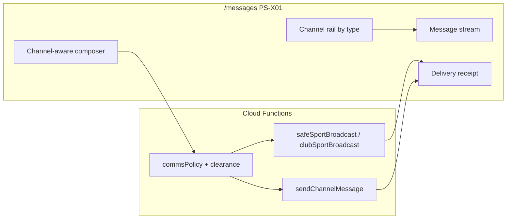

# COMMS Channel Canon — SafeSport-Native Unified Comms OS

**Authority:** Epic 4.13+ implementation · **Extends** [`COMMS_HUB.md`](./COMMS_HUB.md) (policy north star) · **Does not replace** [`SAFESPORT_COMMS_MATRIX.md`](../SAFESPORT_COMMS_MATRIX.md) (control map)

> **For Phase 1 agents:** Read **§6 Delivery contract** first — every send surface must return and render a `deliveryReport`; never show "roster member" alone when the CTA says "Send to parents."

---

## 1. North star

SSTracker is a **SafeSport-native, all-in-one communications and coordination OS** for youth clubs: typed channels (Teams/Discord mental model) scoped by club hierarchy, with **parent-targeted staff reach**, **household-only** parent↔minor interactivity, and **honest delivery semantics** on every send. It is the club's coordination nervous system — practice changes, registration nudges, match-day ops, development intent, compliance, and emergencies — **not** an unmoderated chat app for minors. Minors consume schedule and team context through **Player HQ / calendar UI** and household threads; they never receive a staff 1:1 interactive inbox.

---

## 2. Design principles

### Channel TYPE defines permissions (not free-form channel creation)

Staff and parents do not create arbitrary chat rooms. The platform provisions **channel instances** from a fixed **Channel Type Registry** (§3). Each `type_id` binds: who may post, who receives, minor visibility, reply model, and audit collection. New channel types require vision + ROADMAP approval.

### Every send returns a `deliveryReport` (no silent drops)

All staff send callables return a normative **delivery contract** (§6). The client renders a delivery receipt — delivered vs skipped with reason codes. Partial delivery is success with transparency, not a generic "sent" toast.

### Minors never receive staff 1:1 interactive inbox

Per [`COMMS_HUB.md`](./COMMS_HUB.md) household-only charter: coach→minor DM is **blocked** (`sendCoachPlayerMessage` — Sprint 4.2 Done). Staff→family paths are **announcements**, **Parent Lounge** (monitored group), or **calendar/HQ** mirrors — never a private staff inbox on a minor account.

### Staff clearance before send surfaces

Coaches, directors, registrars, and future team managers must pass **background clearance** ([`docs/CLEARANCE.md`](../CLEARANCE.md)) before compose surfaces unlock. JWT + route policy gates exist today; unified hub inherits the same gate.

### `consentComms` gates push/in-app delivery with visible skip reasons

VPC captures `consentComms` per child ([`/parent/vpc`](../src/routes/(app)/parent/vpc/+page.svelte)). Server paths filter parents via `filterParentsWithCommsConsent` (`commsPolicy.js`) — enforced on broadcast CC and monitored channel repair (Sprint 4.2 Done). Skipped parents appear in `parentSkipped[]` with `consent_comms_declined`. **UX gap:** VPC defaults `consentComms` to `false` — most guardians must opt in explicitly.

### One hub route per persona (`/messages`) — no duplicate compose surfaces

[`PRODUCT_SURFACE_REGISTRY.md`](./PRODUCT_SURFACE_REGISTRY.md) **PS-X01** — single Tier-1 comms route for all personas (`WF-COMMS-SAFESPORT`, `comms-hub` layout). Staff **Outbox** and parent **unread stack** live here. **Known gap:** compose also exists on `/coach/logistics` and `/director?tab=comms` — Phase 1 consolidates read/stream into the hub shell; compose may deep-link but must not fork delivery semantics.

---

## 3. Channel Type Registry

| type_id | display name | purpose | who can post | who receives | minor visibility | reply model | audit collection | shipped | planned phase |
|---------|--------------|---------|--------------|--------------|------------------|-------------|------------------|---------|---------------|
| `announcements` | Team announcements | One-way staff→families; schedule, policy, general team news | coach, director, admin | parents (+ adult players 18+ via push/inbox); minors **not** in interactive inbox | HQ/calendar mirror only | none (reply via Parent Lounge) | `team_broadcasts`, `audit_logs` | **partial** — `safeSportBroadcast`, `clubSportBroadcast`, `commitTeamBroadcast`; UX receipt gap | 4.13a delivery fix |
| `parent_lounge` | Parent Lounge | Monitored parent↔parent and parent↔coach group context | parent, coach, director | parents on team; staff participants | none (parents only in channel) | threaded group (`sendChannelMessage`) | `clubs/{clubId}/channels/*`, `messaging_audit` | **shipped** — 4.4 provisioning + `ParentLoungePanel` | — |
| `team_logistics` | Team logistics | TM/coach/event ops — car pool, field change, equipment | coach (TM future) | parents | HQ/calendar mirror only | optional thread → Parent Lounge handoff | `team_broadcasts` (today) → typed channel doc | **partial** — `/coach/logistics` Team Ops tab (4.7); no `type_id` in data model | Phase 2 |
| `registration` | Registration | Registrar/director transactional — fees, deadlines, eligibility | registrar, director | parents (household-scoped) | none | none | `audit_logs` + registration collections | **partial** — `sendRegistrationPaymentReminders` (4.6); no typed channel | Phase 2 |
| `tryouts_events` | Tryouts & events | Program-scoped tryout/eval comms | director, coach (tryout lead) | parents (applicant households) | none | none | `audit_logs`, tryout collections | **partial** — trial score push triggers; no unified channel instance | Phase 2 |
| `match_day` | Match day | Short-lived gameday — call time, field, lineup note | coach, TM (future) | parents + adult players | HQ match-day band only | none | `team_broadcasts` + `push_gameReminders` | **partial** — `sendScheduledEventReminders`, `sendGameRemindersToday` (4.6); not TTL channel | Phase 2 |
| `development` | Development feedback | Coach intent / HQ mirror — assignments, bounties, adult mail | coach | adult players (18+); parents via announcements for minors | Forge + `ActiveBounties` — not DM | adult: `in_app_messages` DM; minor: blocked | `in_app_messages`, `messaging_audit` | **partial** — Forge intents + adult-only `sendCoachPlayerMessage`; no typed channel | Phase 2+ |
| `household` | Household | Parent↔linked operative only | parent, linked player | same `householdId` members | player sees household thread | bilateral thread | `in_app_messages` (household-scoped) | **shipped** — 4.11 `/messages` household panel | — |
| `staff_internal` | Staff internal | Coach/TM/director/registrar staff-only coordination | coach, director, registrar, TM (future) | staff roles on team/club | none | threaded internal | `messaging_audit` (planned) | **planned** | Phase 3 |
| `compliance` | Compliance | VPC, clearance, incidents, audit notices | director, admin | affected parents/staff | none | none | `message_incidents`, `audit_logs`, `consent_records` | **partial** — 4.9 console, 4.10 `reportMessageIncident`; no typed channel stream | Phase 3 |
| `club_wide` | Club-wide broadcast | Director fan-out to all/selected teams | director, platform admin | parents + adult players per team | HQ/calendar per team | none | `team_broadcasts` (per-team docs), `audit_logs` | **shipped** — 4.8 `clubSportBroadcast` | 4.13a hub surfacing |
| `sponsor_partner` | Sponsor & partner | Template-only, director-approved; parents only | director (approve), system (send) | parents opt-in | none | none | `audit_logs` | **planned** | Phase 4 |
| `emergency` | Emergency | Director break-glass — weather, safety, lockdown | director, admin | all club parents (+ staff) | push + SMS fallback (planned) | none | `audit_logs` (priority flag) | **planned** | Phase 3–4 |

**Shipped vs planned count (honest, post Epic 4.12):** **3 shipped** (`parent_lounge`, `household`, `club_wide`) · **7 partial** (`announcements`, `team_logistics`, `registration`, `tryouts_events`, `match_day`, `development`, `compliance`) · **3 planned** (`staff_internal`, `sponsor_partner`, `emergency`).

---

## 4. Space hierarchy

```
Club (tenant / clubId)
 └── Program / Season (organizations.activeSeason, tryout programs)
      └── Team (teamId)
           └── Channel instances (typed; e.g. parent-lounge-{teamId}, announcements-{teamId})
```

### JWT role → visible spaces

| Role | Club scope | Program/season | Team channels | Notes |
|------|------------|----------------|---------------|-------|
| `player` | — | — | — | No staff inbox; HQ/calendar + household only |
| `parent` | via children's `clubId` | registration status | Parent Lounge, announcements CC, household | `/messages` PS-X01 |
| `coach` | own `clubId` | — | teams in JWT `teamIds` | compose + Outbox |
| `team_manager` *(planned)* | club | assigned teams | logistics, match_day, announcements | not in JWT today |
| `registrar` | club | registration programs | registration channel (planned) | `/registrar` → director tab |
| `director` | `tenantId` / club | all programs | all club teams + club_wide | `/director?tab=comms` |
| `admin` | platform | all | break-glass read | compliance export |
| `recruiter` | clearance-gated | — | read-only prospect threads (future) | PS-X01 minimal |
| `tutor` | clearance-gated | — | supplemental 1:1 (future, adult/minor policy TBD) | future |
| sponsor external | — | — | **none** — template digest only (planned) | parents-only receive |

Channel instances are **provisioned** by type (e.g. `commsChannelOps.provisionParentLounge`) — not user-created. Cross-team visibility requires club-level role or explicit channel membership.

---

## 5. Audience & permission matrix

Legend: **Y** = allowed · **N** = blocked · **C** = conditional (clearance, consent, age, household, or role scope)

SafeSport rules (explicit): (1) **No coach→minor 1:1 interactive DM** — blocked at callable + rules. (2) **Staff→families** via parent-targeted channels with audit. (3) **Parent visibility** on minor-related comms via CC/announcements, not minor inbox. (4) **Monitored group** (`safesportMonitored`) for Parent Lounge — server-only writes. (5) **Household-only** parent↔minor threads — `householdId` gate.

| Persona | announcements | parent_lounge | team_logistics | registration | tryouts_events | match_day | development | household | staff_internal | compliance | club_wide | sponsor_partner | emergency |
|---------|:---:|:---:|:---:|:---:|:---:|:---:|:---:|:---:|:---:|:---:|:---:|:---:|:---:|
| **player** | N | N | N | N | N | C (HQ) | C (HQ/assignments) | C (linked) | N | N | N | N | C (push banner) |
| **parent** | C (read/CC) | C (member) | C (read) | C (read) | C (read) | C (read) | N | C (household) | N | C (read) | C (read) | C (opt-in) | C (read+push) |
| **coach** | C (post) | C (post) | C (post) | N | C (tryout lead) | C (post) | C (adult DM) | N | C (future) | N | N | N | N |
| **team_manager** | C (future) | C (read) | C (future post) | C (future) | C (future) | C (future) | N | N | C (future) | N | N | N | C (future) |
| **registrar** | N | N | N | C (post) | C (read) | N | N | N | C (future) | C (post) | N | N | N |
| **director** | C (post) | C (post) | C (post) | C (post) | C (post) | C (post) | N | N | C (post) | C (post) | C (post) | C (approve) | C (post) |
| **admin** | C | C | C | C | C | C | C | N | C | C | C | C | C |
| **recruiter** | N | N | N | N | C (future) | N | N | N | N | N | N | N | N |
| **tutor** | N | N | N | N | N | N | C (future) | N | N | N | N | N | N |
| **sponsor (external)** | N | N | N | N | N | N | N | N | N | N | N | C (read template) | N |

**Post** = compose/send · **Read** = stream/inbox · **Notify** follows `consentComms` + FCM category (`push_announcements`, `push_messages`, `push_gameReminders`, `push_paymentReminders`).

---

## 6. Delivery contract (normative for Phase 1+)

Today `commitTeamBroadcast` returns `recipientCount` (roster athletes) and `ccParentCount` — **insufficient** for parent-targeted UX. Phase 1 (4.13a) extends all announcement-family callables to return:

```typescript
interface DeliveryReport {
  messageId: string;
  audienceScope: 'team_parents' | 'team_parents_and_adults' | 'club_parents' | 'channel_members' | 'household';
  rosterAthleteCount: number;
  parentDelivered: Array<{ email: string; uid?: string; channels: ('in_app' | 'push' | 'email')[] }>;
  parentSkipped: Array<{
    email: string;
    reason: 'no_household' | 'not_on_roster' | 'consent_comms_declined' | 'not_guardian' | 'push_token_missing';
  }>;
  /** SafeSport minor CC audit — subset of parentDelivered when minors on roster */
  ccParentEmails: string[];
  auditLogId?: string;
  teamId?: string;
}
```

### Reason codes

| Code | Meaning |
|------|---------|
| `no_household` | Minor on roster has no resolvable `householdId` / guardian link |
| `not_on_roster` | Target parent not linked to a rostered athlete on this team |
| `consent_comms_declined` | VPC `consentComms` false or absent |
| `not_guardian` | Email on household doc but not designated guardian for athlete |
| `push_token_missing` | In-app delivery ok; push skipped (informational, not a hard fail) |

### Client rules

1. **Never** display "Sent to N roster members" when CTA is "Send to parents" — show `parentDelivered.length` and `parentSkipped` breakdown.
2. Render **delivery receipt** panel (expandable) on success — [`ParentAnnouncementCompose.svelte`](../src/lib/components/coach/ParentAnnouncementCompose.svelte) and `DirectorClubBroadcastComposer.svelte` are **known gaps** (show `recipientCount` / "roster member").
3. Partial delivery is **success** with yellow/amber receipt — not silent failure.
4. `ccParentEmails` logged in `audit_logs.extra` today — receipt must mirror for staff transparency.

### Current server behavior (gap documentation)

[`commitTeamBroadcast`](../functions/comms.js) resolves parents only via **minor CC path**: for each minor on `player_lookup`, resolve `householdId` → `parentEmails` + `parentEmail`, filter by `consentComms`. **Parents of adult-only rosters** and **non-minor households** are not in `ccParentEmails` — parent delivery is incomplete for parent-targeted announcements. Phase 1 fixes audience resolution to **parent-first** with minor CC as audit subset.

---

## 7. Unified UX shell

**Route:** `/messages` (PS-X01) — all personas; skin per [`PLATFORM_DESIGN_SYSTEM.md`](./PLATFORM_DESIGN_SYSTEM.md).

### Wireframe (prose)

- **Left rail (staff):** Channel list grouped by **type** (Announcements, Parent Lounge, Logistics, …) under team/club headers. Unread badges per channel.
- **Left rail (parent):** Single **unread stack** — Announcements, Parent Lounge(s) for children's teams, Household — no type picker complexity.
- **Main pane:** Message stream for selected channel; read-only for announcements; compose bar only when `type_id` allows reply.
- **Composer:** Channel-aware — subject/body, audience summary preview, clearance badge, post-send **delivery receipt** (§6).
- **Outbox tab (staff):** Sent history with per-message delivery reports and resend-not-allowed (immutable audit).
- **Player:** Minimal — no channel rail; deep-link from HQ notifications only (future). Household thread accessible if teen player account linked.

### Persona skins

| Persona | Shell character |
|---------|-----------------|
| Player | Minimal — notification deep-links; no gamification chrome on comms |
| Parent | Trust-forward — flat co-op partner, 390px-first ([`PARENT_OS_FOUNDATION.md`](./PARENT_OS_FOUNDATION.md)) |
| Coach / TM | SIEM-like density — flat analytical, clearance status visible |
| Director | Oversight — club tree, compliance cross-links, export affordances |

### Flow (mermaid)



**Navigation:** Pin bar / AppMenuSheet includes Messages per [`PLATFORM_NAVIGATION_CANON.md`](./PLATFORM_NAVIGATION_CANON.md). No second compose island — `/coach/logistics` may link to hub compose with `?channel=` deep link (Phase 1).

---

## 8. Known gaps (honest — today)

| Gap | Detail | Target |
|-----|--------|--------|
| **Parent delivery via minor-CC only** | `commitTeamBroadcast` populates `ccParentEmails` only when minors on roster — not full parent audience | 4.13a delivery contract |
| **Misleading success copy** | `ParentAnnouncementCompose`: CTA "Send to parents" but success says "roster member(s)" | 4.13a receipt UI |
| **Fragmented compose** | Team Ops (`/coach/logistics`), Director tab, and `/messages` — three surfaces | 4.13a hub shell |
| **`consentComms` default false** | VPC checkbox defaults off — most parents skipped until opt-in | UX + onboarding prompt |
| **No sponsor/emergency types** | Registry rows planned only | Phase 3–4 |
| **`team_manager` JWT not shipped** | 4.7 delivered coach-delegated Team Ops | Phase 2 |
| **Email/SMS fallback** | FCM-only delivery path | Phase 4 omnichannel |
| **No typed `type_id` on channels** | Parent Lounge uses doc id convention; broadcasts use `team_broadcasts` without type field | Phase 2 data model |
| **Director compose duplicate** | `DirectorClubBroadcastComposer` on `/director?tab=comms` vs hub | 4.13a |

---

## 9. Phased roadmap

Epic 4.1–4.12 **Done** (2026-06-10) — see [`ROADMAP.md`](../../ROADMAP.md) Epic 4 table. **Do not re-duplicate** sprint proof columns here.

| Phase | ROADMAP anchor | Scope |
|-------|----------------|-------|
| **Phase 1** | **4.13a** *(add to ROADMAP)* | Unified hub shell on `/messages`; **delivery contract** + parent-first audience in `commitTeamBroadcast`; delivery receipt UI; parent dashboard unread strip; deep-link from Team Ops |
| **Phase 2** | 4.14+ *(planned)* | Typed `team_logistics`, `registration`, `tryouts_events`, `match_day` channel instances; `team_manager` JWT + `/team-manager` comms rail |
| **Phase 3** | 4.15+ *(planned)* | `staff_internal`, `compliance` stream; `emergency` break-glass; club-wide spaces in hub (surface existing 4.8 backend) |
| **Phase 4** | 4.16+ *(planned)* | `sponsor_partner` templates; email/SMS omnichannel fallback; read/ack compliance for critical announcements |

**Phase 1 agent checklist:** §6 delivery contract → extend `commitTeamBroadcast` return shape → update `CommsEngine` types → receipt components → guard tests in `commsSprint413*.test.ts`.

---

## 10. Explicit non-goals

- **Coach→minor 1:1 DM** — permanently blocked; use announcements + Parent Lounge + HQ intent mirror.
- **Sponsor→minor contact** — sponsors never message players; template digests to consenting parents only.
- **Unmoderated external DMs** — no arbitrary cross-club or stranger messaging.
- **Claiming official SafeSport certification** — platform controls map to policy; clubs must validate with counsel ([`SAFESPORT_COMMS_MATRIX.md`](../SAFESPORT_COMMS_MATRIX.md) disclaimer).
- **Discord/Slack clone for minors** — no always-on social graph for youth.

---

## 11. Related documents

| Document | Role |
|----------|------|
| [`COMMS_HUB.md`](./COMMS_HUB.md) | Policy north star, notification categories, persona handoffs |
| [`SAFESPORT_COMMS_MATRIX.md`](../SAFESPORT_COMMS_MATRIX.md) | Platform control map, callable index, compliance pointers |
| [`FCM_AND_MESSAGING_MATRIX.md`](../FCM_AND_MESSAGING_MATRIX.md) | Push bus inventory, `onTeamBroadcastCreated` flow |
| [`PERSONA_ECOSYSTEM.md`](../PERSONA_ECOSYSTEM.md) | Persona boundaries |
| [`PARENT_OS.md`](./PARENT_OS.md) | Parent comms surfaces, VPC |
| [`TEAM_MANAGER_OS.md`](./TEAM_MANAGER_OS.md) | TM logistics comms (planned JWT) |
| [`DIRECTOR_OS.md`](./DIRECTOR_OS.md) | Club broadcast, compliance console |
| [`PRODUCT_SURFACE_REGISTRY.md`](./PRODUCT_SURFACE_REGISTRY.md) | PS-X01 `/messages` |
| [`PLATFORM_NAVIGATION_CANON.md`](./PLATFORM_NAVIGATION_CANON.md) | Messages in pin bar / menu |
| [`ROADMAP.md`](../../ROADMAP.md) | Epic 4 delivery tracker |
| [`FUNCTIONAL_MVP.md`](./FUNCTIONAL_MVP.md) | Functional comms acceptance rows |
