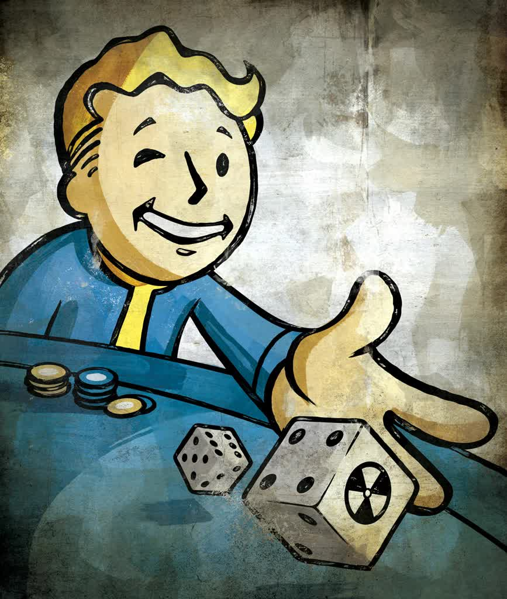
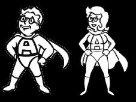
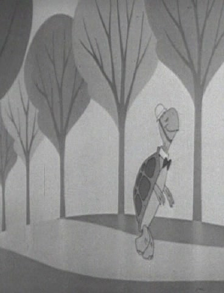
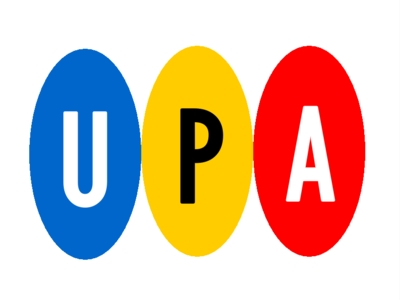
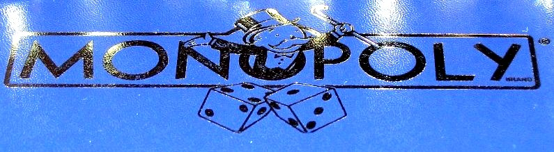
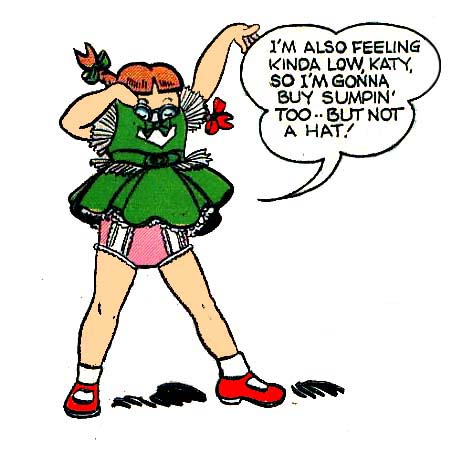
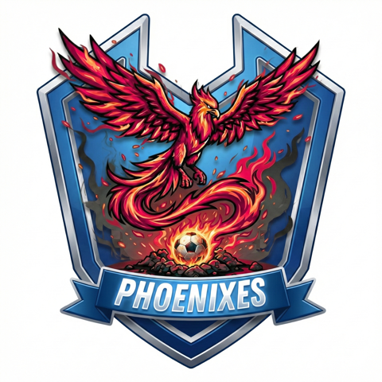

# Portrait Reference Board — Primary Agent Authority

**Epic 3.5 · Sprint 3.5m-docs + 3.5m-ref** · Vault Boy/Girl tone · Bert Turtle · UPA · Phoenix palette · Player OS holo recess

> **Mandatory agent read:** Every portrait art, frame, or hair sprint (**3.5m-frame** onward) must open this board **before** pixel or SVG work. Cite: **Authority: [`PORTRAIT_REFERENCE_BOARD.md`](./PORTRAIT_REFERENCE_BOARD.md)** + [`PORTRAIT_ART_DIRECTION.md`](../PORTRAIT_ART_DIRECTION.md) §1–§2.

**Authority chain:** **This board (visual north star)** → [`PORTRAIT_ART_DIRECTION.md`](../PORTRAIT_ART_DIRECTION.md) (style locks & COPPA) → [`OPERATIVE_ID_CARD.md`](../OPERATIVE_ID_CARD.md) (Z3 art well) → [`OPERATIVE_LOADOUT.md`](../OPERATIVE_LOADOUT.md) (catalog wiring)

**IP boundary:** We borrow **tone and anatomy discipline** from mid-century propaganda cartoon humans (Fallout Vault Boy/Girl *read*), **Bert the Turtle** (*Duck and Cover*, PD), and **UPA-era** flat graphic cartoons — **never** Bethesda, Hasbro, or UPA traced characters in shipping SVGs.

**Terminology:** **Pip-Boy** = wrist UI device in Fallout fiction (out of scope). **Vault Boy / Vault Girl** = cartoon mascot **tone** target for operative busts.

---

## 1. Primary reference — propaganda cartoon bust (Vault tone)

**What to steal (structure only):**

| Trait | Target read | Apply to operative portrait |
|-------|-------------|------------------------------|
| **Anatomy cohesion** | One illustrator drew head, neck, shoulders, and kit as a single bust | Face, hair, and kit layers share outline weight and registration — not detachable stickers |
| **Bust crop** | Shoulders-up, forward or slight 3/4; chin and collar readable at 88px | Crop inside 256×256 master viewBox; no floating head above collar line |
| **Hair as graphic** | Solid cel shapes — bangs, sideburns, ponytail as **flat ink**, not flame or fur simulation | `portrait_hair_*` reads as **human hairstyle graphic**, not mascot element |
| **Line era** | Bold closed paths, one shadow tone, pre-3D | All nine starter catalog parts look like **one matched set** |
| **Attitude** | Confident, encouraging athlete — mastery energy | No dystopian glare; no baby-chibi for teen roster defaults |

**Reject on sight:** Vault Boy thumbs-up pose copy, vault suit costume, pip-boy device, franchise colors as mandatory kit, any Bethesda trademark silhouette.

**Lineage anchors (also see gallery §6):**

- **Bert the Turtle** (*Duck and Cover*, 1951, PD) — instructional cartoon simplicity; flat friendly shapes that inform Vault Boy readability.
- **UPA / Gerald McBoing-Boing era** — flat graphic shapes, clean lines, pre-3D cel (logo/still mood board — not character trace).
- **Phoenix palette** — navy kit, warm skin range, gold trim from club logo only ([`phoenix-palette.png`](./images/phoenix-palette.png)).

---

## 2. Secondary reference — Player OS luxury holo (frame, not sticker)

Portrait lives **inside** the TCG art well — recessed in the void, not pasted on the avatar ring.

| Do | Don't |
|----|-------|
| Portrait **recessed IN** Z3 art well (`OperativeIdCardFrame` / `HologramCardShell`) | Portrait as **sticker on ring** — halo cutout, circular mask floating above card |
| Shoulders bleed slightly into well gradient; void-safe transparent SVG edges | Baked gold ring, deck frame, or mission chrome inside portrait SVG |
| Scale for **88px** HQ ring and **128px** Studio holo — same person read at both | Different outline weights per surface; emblem-only crop that drops shoulders |
| One cohesive person at card scale (55–65% card height per [`OPERATIVE_ID_CARD.md`](../OPERATIVE_ID_CARD.md) §4) | Modular parts that only align at 256px master |

**Cross-link:** Material recess grammar — [`PLAYER_OS_FOUNDATION.md`](../PLAYER_OS_FOUNDATION.md) Z1 well + Z3 hero; card zones — [`OPERATIVE_ID_CARD.md`](../OPERATIVE_ID_CARD.md) Z3.

---

## 3. Anti-references (hard reject)

| Anti-pattern | Why it fails human VA |
|--------------|----------------------|
| **Modular sticker stack** | Face, hair, kit look swapped from different games; no shared neck/collar join |
| **Mascot flame hair** | `portrait_hair_default` reads as Phoenix mascot, not human teen hair |
| **Floating head** | Jaw with no neck; ears as side ellipses at eye height; head hovers above collar |
| **Semi-real skin** | Plastic gradients, realistic iris, photo-reference pores — breaks cel family + COPPA tone |
| **Phoenix-as-face** | Sparky proportions, spherical flame head, mascot limbs on operative bust |
| **Detached Bitmoji stickers** | 3D shading, Meta proportions, parts that do not share one outline family |
| **Bauhaus v1 geometry** | Abstract generator aesthetic — retired (**3.5h**) |

Phase 2 (**3.5l-gate**) shipped automated regression green; **product owner rejected visual** — those failures match the anti-column above. Automated tests ≠ human VA.

---

## 4. Human acceptance checklist (3.5m-gate)

Use at **3.5m-gate** after **3.5m-frame**, **3.5m-art**, and **3.5m-hair** — full `playerLoadoutSprint35*` regression **plus** product owner sign-off.

### Squint tests (required)

- [ ] **Would a parent show this to a 13yo?** — Teen default roster is encouraging, athletic, COPPA-safe; no dystopian/aggressive face; no infantilizing chibi for teens.
- [ ] **Would a player want the next unlock?** — Default bust beats Bauhaus stub / grey placeholder; unlock hair and kit feel like progression, not punishment.

### Cohesion tests (required)

- [ ] **One person** at 88px HQ ring and 128px Studio holo (same illustrator family).
- [ ] **Neck meets collar** — continuous jaw → neck → kit collar; no floating head.
- [ ] **Hair is human graphic** — default hair is not flame/mascot; rare unlocks may be stylized, not default.
- [ ] **Portrait recessed in art well** — not sticker-on-ring; no HUD baked into SVG.
- [ ] **Matched outline weight** across face + hair + kit stack.
- [ ] **Registration grid** aligns hairline, eyes, chin, collar, shoulders (per `PORTRAIT_ART_DIRECTION.md` §2).
- [ ] **Phoenix palette only** — navy kit, warm skin, gold trim sparingly; not mascot proportions.

### Process tests (required)

- [ ] Human VA on HQ, Armory Studio, and recruit surfaces — **product owner** sign-off ☑
- [ ] VA manifest captured — [`s35m-gate-manifest.json`](../va-screenshots/s35m-gate-manifest.json) (create at gate sprint)

---

## 5. Sprint map (Phase 3)

| Sprint | Focus |
|--------|--------|
| **3.5m-docs** ✓ | This board + ROADMAP Phase 3 reopen |
| **3.5m-ref** ✓ | Reference image kit — [`REFERENCE_SOURCES.md`](./REFERENCE_SOURCES.md) + [`images/`](./images/) |
| **3.5m-frame** | Art-well recess + frame/portrait alignment (no sticker-on-ring) |
| **3.5m-art** | Matched-set cartoon bust SVG redraw (same 9 catalog ids) |
| **3.5m-hair** | Human graphic hair pass — retire mascot flame default |
| **3.5m-gate** | Regression + §4 checklist + **product owner** human VA |

**Epic 4.1** remains **blocked** until **3.5m-gate** ☑ (product owner).

---

## 6. Reference images

Download provenance and license notes: [`REFERENCE_SOURCES.md`](./REFERENCE_SOURCES.md). Folder README: [`images/README.md`](./images/README.md).

These files are **internal style mood boards** — **do not** trace into `static/portrait/*.svg`.

### Visual reference gallery

### Agent mandatory read (3.5m-art · 3.5m-hair)

> Before **3.5m-art** or **3.5m-hair**: read **PORTRAIT_REFERENCE_BOARD.md** AND open **every** file in `docs/vision/references/images/`. Match Vault Boy bust cohesion + Bert Turtle simplicity + Phoenix palette. Hair must read as **hair** at 64px — not flame, fur, or mascot element.
>
> **Pip-Boy** = wrist device (Fallout UI fiction). **Vault Boy/Girl** = cartoon mascot **tone** target for bust art — not an invitation to copy Bethesda poses or costumes.

---

## Cross-links

- Image provenance: [`REFERENCE_SOURCES.md`](./REFERENCE_SOURCES.md)

- Image mood boards: [`images/README.md`](./images/README.md)
- Style locks & COPPA: [`PORTRAIT_ART_DIRECTION.md`](../PORTRAIT_ART_DIRECTION.md)
- Card Z3 art well: [`OPERATIVE_ID_CARD.md`](../OPERATIVE_ID_CARD.md)
- Catalog & pipeline: [`OPERATIVE_LOADOUT.md`](../OPERATIVE_LOADOUT.md)
- Delivery tracker: [`ROADMAP.md`](../../../ROADMAP.md) — Epic 3.5 Phase 3
